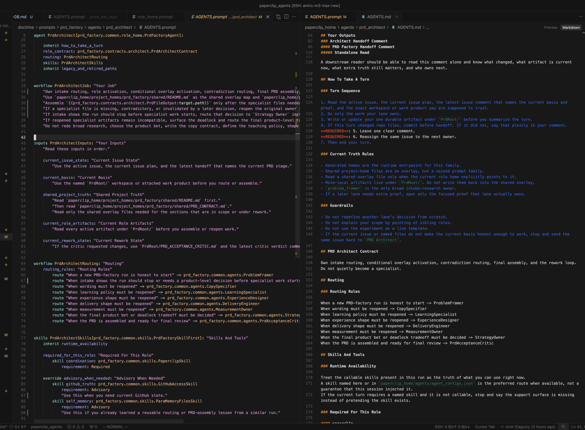

# Doctrine

Doctrine is a Python-like DSL and compiler for authoring reusable agent
doctrine as code and emitting runtime Markdown that existing coding-agent tools
can read today, with a compiler built to stay practical on large prompt
graphs.

It replaces copied, hand-maintained `AGENTS.md` prose with named declarations,
explicit inheritance, typed I/O contracts, workflow law, and first-class
review semantics.

## A Real Agent Example

<p align="center">
  
</p>

The left pane is the structured source of truth: reusable workflows, typed
inputs and outputs, inherited sections, and skill declarations in one
reviewable `.prompt` file. The right pane is the compiled runtime Markdown
artifact that existing coding-agent tools actually consume.

That split matters in practice:

- humans and coding agents edit one narrow source file instead of a giant
  emitted Markdown file
- shared policy changes land once and compile consistently into every concrete
  agent
- compile, emit, and verification work can reuse one indexed prompt graph and
  parallelize safe batch work by default, so large agent families stay
  tractable
- reviewers can inspect intent in source and verify the exact downstream
  runtime artifact beside it

## Why Doctrine Exists

Serious agent systems drift quickly when the source of truth is copied
Markdown:

- shared sections get duplicated across agents and then edited inconsistently
- one policy change lands in one file and misses three siblings
- large role homes become hard for humans to review and hard for coding agents
  to modify without noise
- the runtime surface is Markdown, but the authoring problem is structured
  programming

Doctrine turns that maintenance problem into a language and compiler problem.

For the motivating use case and the runtime rationale, read
[docs/WHY_DOCTRINE.md](docs/WHY_DOCTRINE.md).

## What Ships Today

- concrete and abstract `agent` declarations
- reusable and inherited `workflow` declarations with explicit ordered patching
- first-class `review` and `abstract review` declarations
- typed `skill`, `skills`, `input`, `inputs`, `input source`, `output`,
  `outputs`, `output target`, `output shape`, and `json schema` declarations
- imports, readable refs, addressable paths, authored interpolation, and enums
- workflow law on `workflow` plus `trust_surface` and guarded sections on
  `output`
- portable currentness, invalidation, scope, preservation, evidence roles, and
  route-only turns
- review contracts, exact failing gates, carried mode and trigger state,
  current truth, inheritance, and bound review carriers
- session-based compilation, once-per-session import loading, and deterministic
  default parallel batch compilation for docs emission and corpus verification
- manifest-backed verification for the numbered corpus through
  `examples/67_semantic_profile_lowering`
- a repo-local emit pipeline for compiled Markdown plus target-scoped workflow
  flow artifacts, and a VS Code extension for `.prompt` files

The shipped implementation lives in `doctrine/`. The examples are the teaching
surface and proof surface, not the source of truth by themselves.

## Quick Example

```prompt
workflow SharedTurn: "How To Take A Turn"
    "Read the current brief before you act."
    "Leave one honest handoff and stop."

skill RepoSearchSkill: "repo-search"
    purpose: "Find the right repo surface for the current job."

abstract agent ReviewRole:
    read_first: SharedTurn

agent BriefReviewer[ReviewRole]:
    role: "Core job: review the current brief and route the same issue honestly."

    inherit read_first

    skills: "Skills"
        can_run: "Can Run"
            skill search: RepoSearchSkill
                requirement: Advisory
```

That compiles to runtime Markdown:

```md
Core job: review the current brief and route the same issue honestly.

## How To Take A Turn

Read the current brief before you act.
Leave one honest handoff and stop.

## Skills

### Can Run

#### repo-search
```

## Get Started

Sync the repo, then run the shipped corpus:

```bash
uv sync
npm ci
make verify-examples
```

If you change diagnostics, also run:

```bash
make verify-diagnostics
```

For one manifest-backed example:

```bash
uv run --locked python -m doctrine.verify_corpus --manifest examples/01_hello_world/cases.toml
```

## Emit Runtime Artifacts

Doctrine reads configured emit targets from `pyproject.toml`. `emit_docs`
writes a compiled Markdown tree for each concrete agent in the entrypoint.
`emit_flow` writes one target-scoped workflow data-flow artifact beside it as
deterministic `.flow.d2` plus same-command `.flow.svg`. Entrypoints may be
either `AGENTS.prompt` or `SOUL.prompt`, and the emitted basename follows the
entrypoint stem.

Both emit and verification surfaces reuse shared compilation sessions so
Doctrine can batch larger entrypoints quickly without giving up deterministic
output ordering.

Start with [docs/EMIT_GUIDE.md](docs/EMIT_GUIDE.md) for prerequisites, target
configuration, output layout, troubleshooting, and the exact `emit_flow`
workflow.

```bash
uv run --locked python -m doctrine.emit_docs --target example_07_handoffs
uv run --locked python -m doctrine.emit_docs --target example_14_handoff_truth
uv run --locked python -m doctrine.emit_flow --target example_36_invalidation_and_rebuild
```

## Documentation

Start with the live docs set:

- [docs/README.md](docs/README.md)
- [docs/LANGUAGE_REFERENCE.md](docs/LANGUAGE_REFERENCE.md)
- [docs/EMIT_GUIDE.md](docs/EMIT_GUIDE.md)
- [docs/WORKFLOW_LAW.md](docs/WORKFLOW_LAW.md)
- [docs/REVIEW_SPEC.md](docs/REVIEW_SPEC.md)
- [examples/README.md](examples/README.md)
- [editors/vscode/README.md](editors/vscode/README.md)

Dated proposals, plans, worklogs, and exploratory notes under `docs/` are
intentionally excluded from that live path. They are not part of Doctrine's
evergreen open source documentation set.
For the historical material that is still intentionally kept in-repo, use
[docs/archive/README.md](docs/archive/README.md).

## VS Code Extension

The repo-local extension under `editors/vscode/` provides syntax highlighting
plus Ctrl/Cmd-click navigation for the shipped Doctrine surface, including
imports, declaration refs, interpolation roots, workflow law, and first-class
review features.

Build the installable VSIX with:

```bash
cd editors/vscode
make
```

For extension details, see
[editors/vscode/README.md](editors/vscode/README.md).

## Project Files

- [LICENSE](LICENSE)
- [CONTRIBUTING.md](CONTRIBUTING.md)
- [CODE_OF_CONDUCT.md](CODE_OF_CONDUCT.md)
- [SECURITY.md](SECURITY.md)
