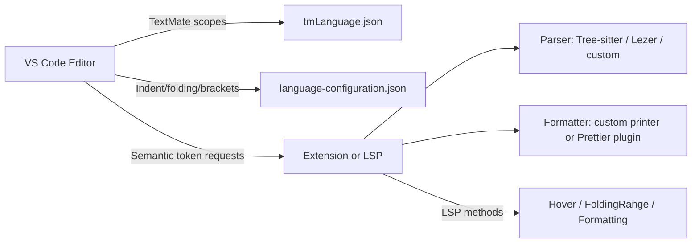

# Building a VS Code syntax highlighter and formatter for a custom DSL

**Langium is almost certainly the fastest path** to a working VS Code extension with syntax highlighting, formatting, diagnostics, and completion for a custom indentation-sensitive DSL. It auto-generates TextMate grammars, a full LSP server, and TypeScript AST types from a single `.langium` grammar file — and since version 3.2, it natively supports indentation-sensitive (off-side rule) parsing via `IndentationAwareTokenBuilder`. A basic DSL with all IDE features can ship in **1–3 days** versus 4–12 weeks hand-writing everything. That said, each layer of the VS Code language stack has distinct tradeoffs worth understanding before committing to an approach. This report covers every major option comprehensively.

---

## TextMate grammars are the foundation — and the ceiling

VS Code uses TextMate grammars as its **primary tokenization engine**. Every built-in language (Python, JavaScript, YAML) ships a `.tmLanguage.json` file that the `vscode-textmate` library processes using Oniguruma regex compiled to WASM. Tokenization runs **line-by-line, top-to-bottom, in a single pass**, storing state at line boundaries for incremental re-tokenization on edits.

A TextMate grammar JSON file declares a `scopeName` (e.g., `source.mydsl`), top-level `patterns`, and a `repository` of reusable rules. Each rule is either a `match` pattern (single-line regex → scope name) or a `begin`/`end` pair (multi-line constructs like strings and block comments). Captures assign scopes to specific regex groups. For a DSL with key-value pairs, named blocks, and string literals, the grammar would look like this:

```json
{
  "scopeName": "source.mydsl",
  "patterns": [{ "include": "#expression" }],
  "repository": {
    "key-value": {
      "match": "(\\w+)(\\s*:\\s*)(.*)",
      "captures": {
        "1": { "name": "entity.name.tag.mydsl" },
        "2": { "name": "punctuation.separator.key-value.mydsl" },
        "3": { "patterns": [{ "include": "#values" }] }
      }
    },
    "strings": {
      "begin": "\"", "end": "\"",
      "name": "string.quoted.double.mydsl",
      "patterns": [{ "match": "\\\\.", "name": "constant.character.escape.mydsl" }]
    }
  }
}
```

Scope naming follows a well-established hierarchy: `keyword.control` for flow keywords, `string.quoted.double` for strings, `entity.name.function` for function names, `variable.other` for variables, and so on. Convention appends the language name as a suffix (e.g., `keyword.control.mydsl`). A minimal color theme only styles roughly 10 root scope groups, so distributing your grammar's scopes across these groups ensures good default appearance.

**The critical limitation for indentation-sensitive languages**: TextMate grammars **cannot natively handle off-side rule scoping**. Each regex matches within a single line only, and there is no mechanism to track indentation depth across lines. A `begin`/`end` pattern needs an explicit closing delimiter — you cannot end a block on dedentation. The Python, YAML, CoffeeScript, and Pug grammars in VS Code all work around this by **not attempting to scope indent-based blocks at all**. They tokenize keywords, strings, comments, and operators per-line without creating nested scopes based on indentation. TextMate 2's `begin`/`while` rules offer partial relief — a region continues while a pattern matches at each subsequent line start — but this remains fragile. For true indentation-aware scoping, you need semantic highlighting or a full parser.

Best practices for grammar authoring include: using the `repository` extensively for reusable rules (referenced via `{ "include": "#rulename" }`), using `{ "include": "$self" }` for recursive grammar embedding, writing grammars in YAML during development (for comments and readability) then converting to JSON for shipping, and debugging with VS Code's **Scope Inspector** (`Developer: Inspect Editor Tokens and Scopes`).

---

## Semantic highlighting layers intelligence on top of regex

Introduced in VS Code 1.43, semantic highlighting provides **project-aware, symbol-resolved** token information that overrides TextMate tokens where they exist. While TextMate colors all identifiers the same, a `DocumentSemanticTokensProvider` backed by a real parser can distinguish a parameter from a local variable from a class name — and it can understand indentation-level scoping that TextMate fundamentally cannot.

The API defines **22 standard token types** (including `namespace`, `class`, `function`, `variable`, `parameter`, `property`, `keyword`, `string`, `number`, `operator`, `decorator`) and **10 standard modifiers** (`declaration`, `definition`, `readonly`, `static`, `deprecated`, `abstract`, `async`, `modification`, `documentation`, `defaultLibrary`). Registration requires building a `SemanticTokensLegend` and implementing a provider:

```typescript
const legend = new vscode.SemanticTokensLegend(tokenTypes, tokenModifiers);
const provider: vscode.DocumentSemanticTokensProvider = {
  provideDocumentSemanticTokens(document) {
    const builder = new vscode.SemanticTokensBuilder(legend);
    // Parse document, emit tokens
    builder.push(range, 'variable', ['readonly']);
    return builder.build();
  }
};
vscode.languages.registerDocumentSemanticTokensProvider(selector, provider, legend);
```

Semantic tokens are encoded as a **compact integer array** (5 integers per token: delta line, delta char, length, type index, modifier bitmask) to minimize memory overhead. The optional `provideDocumentSemanticTokensEdits` method supports delta updates — only changed tokens are retransmitted after the initial full response. For very large files, `DocumentRangeSemanticTokensProvider` computes tokens only for the visible range.

**The layering model** works as follows: TextMate provides the base layer (immediate, synchronous, per-keystroke), and semantic tokens are applied on top once the language server has analyzed the file. This creates a slight delay on file open, but thereafter semantic tokens override TextMate scopes for a richer experience. All built-in VS Code themes (Dark+, Light+, Monokai) have semantic highlighting enabled by default. When a theme lacks specific semantic rules, VS Code falls back to a mapping (e.g., semantic `function` → TextMate `entity.name.function`).

**The recommended strategy for an indentation-sensitive DSL** is two layers: a TextMate grammar for immediate highlighting of keywords, strings, comments, and operators, plus a semantic token provider backed by a parser that understands indentation levels and emits structure-aware tokens.

---

## Tree-sitter in VS Code is promising but not yet native

Tree-sitter is a battle-tested incremental parser generator (MIT licensed, **24k+ GitHub stars**) used natively by Neovim, Emacs 29+, Zed, Helix, and GitHub.com for code navigation. It produces concrete syntax trees with robust error recovery — exactly what editors need. However, **VS Code has no native Tree-sitter integration** as of early 2026.

Several community bridges exist. The **tree-sitter-vscode** extension (by AlecGhost) registers a semantic token provider using user-supplied WASM Tree-sitter parsers and `.scm` query files. The **Syntax Highlighter** extension (by EvgeniyPeshkov) similarly uses VS Code's Semantic Token API to override TextMate highlighting with Tree-sitter-based tokens. Microsoft's own **vscode-anycode** extension uses Tree-sitter under the hood for lightweight Outline/Breadcrumbs/Go to Symbol features in `vscode.dev`, but it **does not provide syntax highlighting** and appears to be in maintenance mode.

The common technical approach is: use `web-tree-sitter` (the WASM build, since native `node-tree-sitter` has Electron ABI compatibility issues) → parse source → run `.scm` highlight queries → feed results to VS Code's Semantic Token API. Tree-sitter's query language maps node patterns to highlight names like `@keyword`, `@function`, `@string` using S-expression syntax.

For indentation-sensitive languages, Tree-sitter requires an **external scanner** — a C function that emits synthetic INDENT/DEDENT tokens. The `tree-sitter-python` grammar uses this approach. Writing an external scanner requires C programming and is recognized as one of the more challenging aspects of Tree-sitter grammar authoring.

**The VS Code team has shown active interest** in native Tree-sitter support. Issue #50140 (from 2018) is a long-running feature request. An internal exploration (issue #210475, assigned to alexr00 in April 2024) is investigating Tree-sitter tokenization performance and a contribution model. The key blocker cited by VS Code team member alexdima is Tree-sitter's parser ABI versioning — periodic ABI changes could break extensions, conflicting with VS Code's stability guarantees. As of early 2026, this remains in exploration with no shipping timeline.

**Tradeoffs versus TextMate**: Tree-sitter offers context-aware, accurate parsing with proper nesting and error recovery, versus TextMate's fast but imprecise regex matching. But Tree-sitter requires extension-level workarounds for VS Code, lacks theme compatibility (TextMate scopes are what themes target), and has a less mature VS Code ecosystem. For a new custom DSL, building a Tree-sitter grammar mainly makes sense if you also plan to support Neovim/Zed/Emacs, or if you want to use Topiary for formatting.

---

## Langium generates an entire language toolchain from one grammar

Langium is a TypeScript-based language engineering framework from TypeFox (the creators of Xtext), now an **Eclipse Foundation graduated project** (since late 2024, version 3.3). It uses Chevrotain under the hood for blazing-fast LL(k) parsing and generates a complete VS Code extension from a single `.langium` grammar definition.

What you get from `npm run langium:generate`: TypeScript AST interfaces, a full parser, an auto-generated `.tmLanguage.json` TextMate grammar, and a complete Language Server providing syntax error reporting, context-aware code completion, go-to-definition/find references, document symbols/outline, rename/refactoring, hover information, and semantic highlighting via `AbstractSemanticTokenProvider`.

**Indentation-sensitive language support** was added in Langium 3.2 through `IndentationAwareTokenBuilder` and `IndentationAwareLexer`. These generate synthetic INDENT/DEDENT tokens from whitespace, with configuration options for delimiter-aware indentation ignoring (like Python's behavior inside brackets/parentheses). Few competing frameworks handle this so cleanly.

**Formatting** is supported via the `AbstractFormatter` class with a node-based API:

```typescript
export class MyFormatter extends AbstractFormatter {
  protected format(node: AstNode): void {
    if (ast.isBlock(node)) {
      const formatter = this.getNodeFormatter(node);
      formatter.property("name").surround(Formatting.oneSpace());
      formatter.nodes(...node.children).prepend(Formatting.indent());
    }
  }
}
```

Options include `newLine()`, `indent()`, `oneSpace()`, `noSpace()`, and `spaces(n)`. Formatting is not auto-generated — you must write rules manually — but the API is clean and well-documented.

**Effort estimates** compared to alternatives:

- Hand-written TextMate + LSP from scratch: **4–12 weeks**
- Tree-sitter + custom LSP server: **3–8 weeks**
- ANTLR + custom LSP server: **3–8 weeks**
- **Langium: 1–3 days** for basic IDE features; **2–6 weeks** for production quality

**Limitations**: LL(k) parser cannot handle left-recursive grammars directly (requires left-factoring). The auto-generated TextMate grammar is sufficient for basic cases but may need manual refinement for complex languages. Community is growing but smaller than Xtext's (~400 GitHub stars, ~4,000 npm downloads/week). Documentation at langium.org is generally good, though it can lag behind rapid framework evolution. No built-in type system — type checking must be implemented manually.

---

## LSP and the VS Code formatting API work together or independently

The Language Server Protocol defines a JSON-RPC-based client-server architecture. The lifecycle begins with an `initialize` handshake where capabilities are negotiated — a server can support formatting but not completion. For formatting specifically, LSP defines three requests:

- **`textDocument/formatting`** — full document formatting
- **`textDocument/rangeFormatting`** — selection formatting
- **`textDocument/onTypeFormatting`** — triggered by specific characters (e.g., `;`, `}`, `\n`)

All three return `TextEdit[]` — arrays of range+replacement pairs applied to the original document. Ranges must never overlap, and edits are applied bottom-to-top.

The `FormattingOptions` object carries `tabSize`, `insertSpaces`, and since LSP 3.15, `trimTrailingWhitespace`, `insertFinalNewline`, and `trimFinalNewlines`.

Four major LSP server libraries compete across languages:

**vscode-languageserver-node** (Microsoft, Node.js) is the reference implementation and most mature option. Minimal boilerplate — `createConnection()`, register handlers, done. Best VS Code integration, largest community, most tutorials. Limited by Node.js single-threaded model for CPU-intensive parsing.

**tower-lsp** (Rust) builds on the Tower service abstraction and Tokio async runtime. Excellent performance, small binaries, no runtime dependency. Steeper learning curve (Rust + async). The community has forked into `tower-lsp` (original) and `tower-lsp-server` (community), creating some confusion. ~1K GitHub stars.

**pygls** (Python, maintained by Open Law Library) uses a decorator-based API that gets a working server in ~15 lines. Extremely Pythonic, ideal for prototyping. Limited by Python's GIL for parallelism and slower execution. ~200+ known implementations.

**lsp4j** (Java, Eclipse Foundation) is very mature but verbose. Best for JVM-based language tooling. JVM startup overhead (~500ms+) and larger distribution size are downsides.

On the VS Code Extension API side, you can register formatters directly without LSP:

```typescript
vscode.languages.registerDocumentFormattingEditProvider('mydsl', {
  provideDocumentFormattingEdits(document, options) {
    const formatted = formatMyDSL(document.getText(), options.tabSize);
    const fullRange = new vscode.Range(
      document.positionAt(0), document.positionAt(document.getText().length)
    );
    return [vscode.TextEdit.replace(fullRange, formatted)];
  }
});
```

The three provider interfaces — `DocumentFormattingEditProvider`, `DocumentRangeFormattingEditProvider`, and `OnTypeFormattingEditProvider` — map to Format Document, Format Selection, and format-on-type respectively. When multiple formatters register for the same language, VS Code either uses the user's `editor.defaultFormatter` setting or prompts for selection. **Only one formatter runs at a time** — no chaining.

**When to use LSP versus direct API**: Use the direct VS Code API for VS Code-only extensions with lightweight formatting logic and no persistent server state. Use LSP when you want editor-agnostic support, need persistent state (parsed AST, symbol tables) for intelligent formatting, or are building a complete language experience where formatting is one of many features. When using LSP, the `vscode-languageclient` library automatically bridges LSP formatting requests to VS Code's infrastructure — no separate `DocumentFormattingEditProvider` registration needed.

---

## Five approaches to building a formatter, from trivial to industrial

The universal formatter pipeline is: **source → parse → AST → pretty-print → output**. For indentation-sensitive languages, the parser must track indentation as syntax (encoding it in the tree structure), and the printer re-emits indentation proportional to nesting depth. Since the tree structure IS the semantic structure, normalizing indentation (e.g., always 4 spaces per level) preserves meaning.

**Approach 1: Template-based string emission.** Walk the AST, emit strings with manual indentation tracking using a depth counter. Under 50 lines of code for a simple DSL. No line-width intelligence, hard to maintain as the DSL grows. Best for DSLs with completely predictable structure that won't evolve.

**Approach 2: Wadler-Lindig pretty-printing algorithm.** Philip Wadler's 2003 paper "A Prettier Printer" describes an algebraic approach using six document combinators: `nil`, `text(s)`, `line`, `nest(i, doc)`, `concat`, and `group(doc)`. The `group` combinator encodes layout choices — try flat first, break at `line` positions if the flat version exceeds the print width. The algorithm is **greedy and O(n)**, resolving groups one line at a time. Implementations exist in every major language: the Rust `pretty` crate (502K+ monthly downloads), Python's `wadler_lindig` package (96 lines for the core algorithm), Haskell's `prettyprinter` library, and — notably — **Prettier's core engine is directly based on this algorithm**. For a custom DSL, you write a recursive `to_doc()` function converting each AST node to a Doc, then render with a target width. This is typically **100–200 lines of formatting code** for a small DSL.

**Approach 3: Prettier plugin.** Prettier's plugin API is the same API used by all its built-in language implementations. A plugin exports `languages`, `parsers` (with `parse`, `locStart`, `locEnd`), and `printers` (with a `print` function). The printer builds a **Doc IR** using commands like `group()`, `indent()`, `line`, `softline`, `hardline`, `fill()`, and `ifBreak()` — these map directly to Wadler's combinators. You get Prettier's battle-tested line-breaking, comment-handling infrastructure, and automatic editor integration for free. The downside: you must write the plugin in JavaScript/TypeScript, you're tied to Prettier's opinionated model, and **plugin composition is fragile** — multiple plugins targeting the same language can conflict. Roughly **2–5 days of effort**, and 30+ community plugins exist for reference (Solidity, PHP, Ruby, XML, Pug, SQL).

**Approach 4: Topiary (Tree-sitter query-based formatting).** A Rust-based universal formatter by Tweag where formatting rules are expressed as declarative Tree-sitter queries. You write patterns like `(infix_operator) @append_space` to add spaces after operators. Extremely fast development — a GDScript formatter was built in hours. However, Topiary's maintainers explicitly state it is **"not suitable for languages that employ semantic whitespace"** — ruling it out for indentation-sensitive DSLs.

**Approach 5: dprint (Rust + Wasm plugin platform).** A pluggable formatting platform where plugins are sandboxed Wasm modules. The `dprint-core` crate provides a Wadler-style IR with `PrintItems`. Medium-high effort (3–7 days) and smaller community, but fast execution and strong sandboxing. Best for Rust-based toolchains needing high performance.

For an indentation-sensitive DSL compiling to markdown, **Approach 2 (standalone Wadler-style) or Langium's AbstractFormatter** are the strongest choices. Both give full control over indentation-as-syntax preservation, and for a small DSL the implementation is very tractable.

---

## Scaffolding, configuration, and the practical details that matter

**The `yo generator-code` scaffolding tool** bootstraps a VS Code extension project. Install with `npm install -g yo generator-code`, run `yo code`, and select "New Language Support." It generates: a `syntaxes/` directory with a `.tmLanguage.json` stub, a `language-configuration.json` with basic bracket/comment definitions, a `package.json` with `contributes.languages` and `contributes.grammars` entries, and a `.vscode/launch.json` for debugging in the Extension Development Host. You must add grammar rules, formatting logic, and language server support manually.

For Langium-based projects, use `npm install -g yo generator-langium` followed by `yo langium` — this scaffolds a complete project with grammar file, language server, VS Code client, and optional CLI.

**The `language-configuration.json` file** controls bracket matching, auto-closing, commenting, folding, and indentation behavior. For an indentation-sensitive DSL, the most important settings are:

- **`onEnterRules`**: Define patterns that trigger auto-indent on Enter. For a DSL with keywords that open blocks: `{ "beforeText": "^\\s*(?:block|section|def).*:\\s*$", "action": { "indent": "indent" } }`
- **`editor.foldingStrategy": "indentation"`** in `configurationDefaults`: VS Code's built-in indentation-based folding is the default fallback and works perfectly for Python-like languages without any extra configuration
- **`indentationRules`**: Regex patterns for `increaseIndentPattern` and `decreaseIndentPattern`. For indentation-sensitive languages, the Python team found these **insufficient** alone (GitHub issue #8996) and supplemented with `onEnterRules` and programmatic `formatOnType` handlers

The `package.json` manifest registers everything: `contributes.languages` (id, aliases, file extensions, configuration path, icon), `contributes.grammars` (language, scopeName, path, embeddedLanguages), and `contributes.configurationDefaults` for per-language editor settings. Since VS Code 1.74, extensions that contribute a language are activated implicitly on `onLanguage` — no explicit activation event needed, though always include at least a minimal `language-configuration.json` to avoid activation issues.

**Testing tools**: Use `vscode-tmgrammar-test` (npm package) for TextMate grammar unit tests (inline `^` annotations asserting scopes) and snapshot tests (auto-generated `.snap` files detecting regressions). Use `@vscode/test-electron` for integration testing that launches a real VS Code instance. Both work in headless CI with `xvfb-run`. The **vscode-textmate-languageservice** library can generate folding, document symbols, and other features directly from TextMate grammars without writing a language server — useful for quickly bootstrapping basic structural features.

**Packaging and publishing**: Use `@vscode/vsce` to create `.vsix` files (`vsce package`) and publish to the marketplace (`vsce publish`). For open-source editors like VSCodium and Gitpod, also publish to Open VSX (`ovsx publish`). The `HaaLeo/publish-vscode-extension` GitHub Action handles both marketplaces.

---

## The Monarch tokenizer is Monaco-only, not VS Code

Monarch is Monaco Editor's built-in declarative tokenization system — a JSON-based, state-machine-driven tokenizer using JavaScript regex. It was created because TextMate grammars originally required native Oniguruma, which couldn't run in browsers. Monarch features explicit state management (`@push`/`@pop`), efficient keyword arrays with `cases` guards, and dynamic token classes via `$1` capture expansion.

**Monarch cannot be used in VS Code extensions.** VS Code Desktop uses TextMate grammars exclusively for syntax highlighting. Monarch is only accessible through `monaco.languages.setMonarchTokensProvider()` in standalone Monaco deployments (e.g., web-based code playgrounds). Since Oniguruma now compiles to WASM, the `monaco-tm` library also enables TextMate grammars in standalone Monaco, making Monarch less essential even in its native domain. For a VS Code extension, Monarch is irrelevant — use TextMate grammars plus optional semantic tokens.

---

## Real-world extensions for indentation-sensitive languages to study

The best reference implementations for indentation-sensitive VS Code language support:

- **Python** (built-in grammar at `microsoft/vscode/extensions/python/`; main extension at `microsoft/vscode-python`): TextMate grammar for basic syntax, Pylance adds semantic highlighting. Uses `onEnterRules` for indent-triggering keywords. Formatting delegated to external tools (Black, autopep8). The `vsc-python-indent` community extension by kbrose is an especially instructive reference — it parses Python code on Enter to determine correct indentation.

- **YAML** (`redhat-developer/vscode-yaml`): Built-in TextMate grammar plus a YAML Language Server for validation, completion, and formatting. Uses VS Code's built-in indentation-based folding.

- **Haskell** (`haskell/vscode-haskell`): TextMate grammar from `language-haskell` plus semantic tokens from HLS (Haskell Language Server). Formatting via HLS integration with Ormolu/Fourmolu/Stylish Haskell.

- **CoffeeScript** (built-in at `microsoft/vscode/tree/main/extensions/coffeescript`): Pure TextMate grammar, no semantic tokens or language server. Minimal `language-configuration.json`. Relies on indentation-based folding. A good minimal reference.

- **Pug** (built-in at `microsoft/vscode/tree/main/extensions/pug`): Purely indentation-based template language. TextMate grammar uses `begin`/`while` patterns with `^(\s*)` captures for partial indentation handling. Sets `diffEditor.ignoreTrimWhitespace: false` as a language default.

- **Nim** (`nim-lang/vscode-nim`): TextMate grammar with indentation-based folding. Formatting delegated to external `nimpretty` tool.

---

## Choosing the fastest path: a decision framework

For a custom indentation-sensitive DSL that compiles to markdown, three viable paths exist ranked by speed-to-working-extension:

**Path 1 — Langium (recommended fastest path)**. Define your grammar in a `.langium` file using `IndentationAwareTokenBuilder` for off-side rule support. Run `langium:generate` to get a TextMate grammar, parser, AST types, and LSP server. Write a formatter extending `AbstractFormatter`. Package with `vsce`. **Total effort: 1–5 days for a working extension with highlighting, formatting, validation, and completion.** Tradeoff: LL(k) parser limitations, smaller community than hand-rolled solutions, TypeScript-only stack.

**Path 2 — Hand-rolled TextMate + direct VS Code formatter**. Scaffold with `yo code`, write a TextMate grammar for basic syntax elements, add a `DocumentFormattingEditProvider` that parses your DSL and re-emits formatted output using Wadler-style pretty-printing (import `prettier.doc.builders` directly, or use a standalone implementation). **Total effort: 1–2 weeks for highlighting + formatting.** Tradeoff: no completion, diagnostics, or go-to-definition without additional LSP work; TextMate grammar can't scope indent blocks.

**Path 3 — TextMate + custom LSP server (Node.js or Rust)**. Use `vscode-languageserver-node` or `tower-lsp` to build a language server with a real parser, providing semantic tokens, formatting, diagnostics, and completion. Layer semantic highlighting on top of a TextMate grammar for immediate visual feedback. **Total effort: 3–8 weeks for a complete IDE experience.** Tradeoff: significantly more work, but maximum control and accuracy.

All three paths should set `"editor.foldingStrategy": "indentation"` in `configurationDefaults` to get correct code folding out of the box.

## Conclusion

The VS Code language extension ecosystem is layered by design: TextMate grammars provide instant regex-based tokenization, semantic tokens add parser-aware intelligence on top, LSP servers deliver formatting and diagnostics, and `language-configuration.json` handles the mechanical editor behaviors like bracket matching and indentation. For indentation-sensitive DSLs specifically, the key insight is that **TextMate grammars fundamentally cannot scope indent-based blocks** — every production indentation-sensitive extension (Python, YAML, Haskell) works around this by tokenizing per-line syntax elements and delegating structural understanding to semantic tokens or a language server.

Langium collapses the multi-week effort of hand-building each layer into a single generate step, with native off-side rule support since version 3.2 making it uniquely suited for Python-like DSLs. For formatting, the Wadler-Lindig algorithm (or its practical incarnation in Prettier's Doc IR) is the proven approach — it naturally handles indentation through `nest`/`indent` combinators and makes line-breaking decisions automatically. The strongest combination for a custom DSL that compiles to markdown: **Langium for the complete toolchain, supplemented by manual TextMate grammar refinements and a custom `AbstractFormatter` using Wadler-style indentation rules**, with `vscode-tmgrammar-test` ensuring grammar correctness and `vsce` for packaging.

----


# Practical Options for a VS Code Syntax Highlighter and Formatter for an Indentation-Sensitive Python-like DSL

## Executive summary

Your DSL has a Python-like “header ends with `:` + indentation defines blocks” shape (e.g., `agent Name:`) with nested key/value pairs and docstring-like string blocks. That combination strongly suggests a **two-layer strategy**: ship **TextMate + language-configuration.json** for fast baseline highlighting and editor behaviors, then add **semantic tokens and formatting** via either (a) a lightweight in-extension parser/formatter, or (b) a full Language Server (LSP) if you want hover/tooltips, folding ranges, and richer UX. VS Code explicitly positions semantic tokens as an **addition on top of TextMate highlighting**, not a replacement, which supports this layered approach. citeturn8view1turn9view0

The practical implementation “families” you can choose from are:

1) **Declarative-only (TextMate grammar + language configuration)**: fastest to ship, easiest to maintain, and runs broadly (including VS Code for the Web) as it requires no extension runtime code if you only contribute grammars and config. This is ideal if your first goal is “nice coloring + correct indent/folding/brackets.” citeturn8view1turn12view4turn11view3turn28view0

2) **Editor-first (extension provides semantic tokens + formatter)**: keep TextMate for baseline, add a semantic token provider for correctness where regex grammars struggle, and implement a formatter as a `Format Document` provider (or embed Prettier). This keeps complexity moderate while delivering a big UX jump. citeturn9view0turn26view2turn24search0

3) **Full-featured LSP (desktop + web)**: best if you want hover/tooltips, project-aware semantics, diagnostics, folding ranges, and semantic tokens as your “primary truth.” VS Code supports running LSP servers in the browser/web extension host (WebWorker) as well as desktop, but the engineering surface is larger. citeturn11view3turn20view2turn18view2turn7view0turn7view1turn7view2turn7view3

For parsing/AST and incremental correctness, the two most practical “serious” options are:

- **Tree-sitter**: incremental parsing designed for “parse on every keystroke,” with robust error tolerance and a mature ecosystem. It supports indentation-sensitive lexing via **external scanners** (common for INDENT/DEDENT). citeturn17view1turn17view2turn15view0  
- **Lezer**: incremental parsing system designed specifically for code editors, producing compact concrete syntax trees suitable for highlighting and lightweight analysis. citeturn30search0turn30search1turn30search2

Formatting has its own fork in the road:

- **Write your own formatter** (AST-to-text, ensure idempotence) and wire it into VS Code’s formatting API (best practice) rather than a custom command. citeturn26view2turn7view1  
- **Use Prettier’s plugin system** (parser + printer) so you inherit a battle-tested formatting engine, configuration conventions, and lots of editor integration pathways. citeturn24search0turn24search1  

Unspecified details (kept explicit): file extension(s) for the DSL, comment syntax, exact string literal forms (single/double/triple quotes), whether web support is required vs optional, and whether the formatter must preserve comments/blank lines exactly vs approximately.

## Your DSL’s editor-facing surface and implications

Your language surface (as described) includes:

- **Indentation-sensitive blocks** (Python-like): the editor must behave well on Enter, indentation, and folding. VS Code supports indentation behaviors via `indentationRules` and `onEnterRules`, and folding can be indentation-based (optionally augmented with regex markers) when no folding provider exists. citeturn12view4turn12view3
- **Headers ending with `:`** such as `agent Name:`: this maps cleanly onto `onEnterRules.beforeText` patterns that indent after colon-terminated headers (VS Code even shows Python-like examples). citeturn12view3
- **Nested blocks and key/value pairs**: regex grammars can highlight these, but correctness degrades as nesting/edge cases grow. Semantic tokens or a real parser helps if you want accurate classification of keys vs values vs headers across arbitrary nesting. citeturn8view1turn9view0
- **Docstring-like strings**: multi-line constructs are typically the hardest part of regex-only tokenization; parsers (Tree-sitter/Lezer) handle this more reliably, and LSP/semantic providers can refine tokens after the fact. citeturn8view1turn9view0turn17view1

Platform implications:

- **VS Code desktop** runs extensions in a Node.js extension host (plus other configurations). citeturn10view0  
- **VS Code for the Web** runs extensions in a browser WebWorker runtime with key limitations: no child processes, no runtime module loading beyond `require('vscode')`, and you generally must bundle to a single file. citeturn11view3turn11view0  
- Declarative-only grammar extensions can run in VS Code for the Web without adding a `main`/`browser` entry, while code-based extensions must provide a `browser` build for the web host. citeturn11view3turn28view0

## Comparative options table

| Approach | Pros | Cons | Complexity | Best use cases | Notable libraries/tools |
|---|---|---|---|---|---|
| TextMate grammar + language-configuration.json (no code) | Fast to ship; very common in VS Code; tokens update as user types; works well for simple DSLs; can run as declarative extension (good for VS Code Web) | Regex-based; struggles with deep nesting, context sensitivity, and tricky multi-line strings; limited “semantic” UX | Low | MVP highlighting + indentation + folding + bracket config | VS Code Syntax Highlight Guide; Language Configuration Guide citeturn8view1turn12view4turn11view3 |
| TextMate + semantic tokens provider (in extension) | Semantic highlighting overlays TextMate; can classify “roles/keys/identifiers” accurately once parsed; supports delta updates in provider API | You own parsing/token logic; must optimize for responsiveness | Medium | Better-than-regex highlighting without full LSP | `DocumentSemanticTokensProvider` + `provideDocumentSemanticTokensEdits` citeturn9view0turn8view1 |
| Full LSP (Node/TS) | Standard way to add hover, folding ranges, formatting, semantic tokens, diagnostics; portable across editors; clearly defined protocols | More moving parts; client/server wiring; lifecycle, caching, concurrency | High | Full language experience; future-proofing | LSP spec; VS Code LSP sample citeturn6view0turn7view0turn7view2turn18view2turn21search22 |
| LSP in the browser (web extension) | Enables rich features on vscode.dev/github.dev; aligns with web extension restrictions | Must run in WebWorker; bundle aggressively; avoid Node APIs | High | You require web support and rich features | VS Code web extensions guide; LSP web sample using `vscode-languageserver/browser` citeturn11view3turn20view2turn20view0 |
| Tree-sitter-based semantic token/highlight pipeline | Incremental parsing on edits; robust with syntax errors; strong community grammar ecosystem; supports external scanners (indent/dedent) | Grammar + scanner work; build chain (native/WASM); integrate into VS Code via semantic tokens or your own pipeline | Medium–High | Indentation-sensitive DSLs where regex grammars get brittle | Tree-sitter docs; external scanners; `tree-sitter build --wasm`; Microsoft `vscode-tree-sitter-wasm` repo citeturn17view1turn17view2turn17view3turn15view0 |
| Lezer-based semantic token pipeline | Incremental parsing designed for editors; JS-first modules; compact trees for highlighting/basic analysis | Less “drop-in” for VS Code than LSP/TextMate; you still write integration | Medium | If you want editor-grade incremental parsing in TypeScript/JS | Lezer parser system & LR runtime citeturn30search0turn30search1turn30search2 |
| Prettier plugin for your DSL (formatter) | Battle-tested formatting engine; options system; many workflows already support it; clean “parser + printer” architecture | You must implement a parser and printer; comment attachment/locations can be tricky | Medium–High | You want consistent, idempotent formatting and shareable tooling | Prettier plugin docs; printers/Doc IR citeturn24search0turn24search1 |
| Custom formatter wired to VS Code formatting API | Simple end-to-end; you control style; can be lightweight | Harder to guarantee idempotence across edge cases unless AST-based; must handle cursor/range formatting | Medium | Early formatter that matches your DSL rules | VS Code formatter best practices (use formatting API) citeturn26view2turn7view1 |
| Monaco/Monarch tokenizer (mostly outside VS Code) | Great if you also target Monaco-based editors or custom web editors; declarative JSON tokenizer with states | Not the standard VS Code grammar mechanism; won’t automatically plug into VS Code TextMate pipeline | Low–Medium | If your DSL will also live in Monaco-based apps | Monarch docs citeturn30search3 |

## Syntax highlighting and editor UX implementation details

### Baseline highlighting with TextMate

VS Code’s built-in tokenization for syntax highlighting is powered by TextMate grammars, and those grammars rely on Oniguruma regular expressions. The TextMate tokenization engine runs in the renderer process and updates tokens as the user types—so performance and regex design matter. citeturn8view1turn8view0

Practical guidance for your DSL’s TextMate grammar:

- Treat `agent`, `role`, `workflow`, and step names as **keywords / identifiers** using standard scopes (to maximize theme compatibility). VS Code recommends building on existing common TextMate scopes where possible. citeturn8view0  
- Highlight a **header line ending with `:`** as a distinct scope (e.g., `entity.name.type` for the block “kind” like `agent`, and `entity.name` for the identifier), and give the trailing `:` a punctuation scope—this tends to theme well.
- Strings: start with robust patterns for single-line quoted strings; if you have multi-line docstrings, you can approximate with begin/end patterns, but parsers outperform regex once nesting appears.

TextMate grammar contributions are made through the `grammars` contribution point. citeturn8view1turn27search20

Testing and maintaining TextMate grammars:

- Microsoft publishes `vscode-textmate`, a library to tokenize text with TextMate grammars, and `vscode-oniguruma`, Oniguruma bindings used by VS Code. citeturn31search0turn31search1turn31search25  
- For unit-style grammar tests, `vscode-tmgrammar-test` exists as “test helpers for VSCode textmate grammars.” citeturn31search2  
- A high-quality reference is Microsoft’s `vscode-markdown-tm-grammar`, which stores fixtures and generated test results and runs grammar tests via npm scripts—useful as a pattern for snapshot/scope regression testing. citeturn31search18  

### Editor behaviors without a parser: language-configuration.json

A lot of “it feels like a real language” UX can be achieved with language configuration alone:

- **Brackets + bracket navigation**: define bracket pairs in `brackets` so VS Code can match them and support “Go to Bracket / Select to Bracket.” citeturn12view0  
- **Indentation behaviors**: `indentationRules` lets you specify regex patterns for increasing/decreasing indentation, plus `indentNextLinePattern` and `unIndentedLinePattern`. citeturn12view4turn12view1  
- **Colon-headers on Enter**: `onEnterRules` can indent when a line matches a regex like Python’s `....*?:\s*$`—this is directly relevant to `agent Name:` and nested `key:` syntax. citeturn12view3  
- **Folding**: if you don’t supply a folding provider, VS Code can use indentation-based folding, and you may add `folding.markers` regexes to create region folding. citeturn12view4  

This is the “lowest effort, highest perceived polish” set of features to build first.

### Semantic tokens for accurate incremental highlighting

Semantic highlighting is explicitly described as an “addition to syntax highlighting.” It overlays TextMate’s lexical highlighting with deeper classification (often from a language server) and can appear after a short delay since project analysis can take time. citeturn9view0turn8view1

Implementation options:

- Implement `DocumentSemanticTokensProvider` inside your extension, optionally with `provideDocumentSemanticTokensEdits` for delta updates. citeturn9view0turn7view0  
- If you go full LSP, implement `textDocument/semanticTokens/full` and optionally the delta form `textDocument/semanticTokens/full/delta` for incremental updates. citeturn7view0  

Best practice for accessibility and theme compatibility: use VS Code’s **standard semantic token types/modifiers** when possible; VS Code documents both the standard set and how to define custom subtypes/modifiers in `package.json` with `semanticTokenTypes`/`semanticTokenModifiers`. citeturn9view0

### Folding ranges, hover/tooltips, and richer UX

If you want folding that understands your DSL’s structure beyond indentation heuristics, you can provide folding ranges either via a language server responding to `textDocument/foldingRange` or via VS Code APIs. The LSP folding range request is standardized and VS Code’s language configuration guide explicitly calls out language-server folding. citeturn12view4turn7view2

For hover/tooltips, LSP provides `textDocument/hover` with a well-defined request/response pattern. citeturn7view3turn6view0

## Formatting approaches and indentation-sensitive strategies

### Use VS Code’s formatting API (don’t invent your own command)

VS Code best practice is to integrate formatters through the formatting API so users get consistent “Format Document / Format Selection” UX instead of bespoke commands. citeturn26view2

Also note: VS Code distinguishes indentation behaviors from formatting providers; e.g., `editor.formatOnPaste` is controlled by range formatting providers, not auto indentation. citeturn12view3

### Idempotent formatting design for an indentation DSL

For indentation-sensitive formatting, the key engineering goal is **idempotence**: formatting twice produces the same output.

Common successful strategy (applies whether you write your own formatter, a Prettier plugin, or an LSP formatting handler):

- Parse → build a tree → print with deterministic whitespace rules → emit edits.
- Ensure INDENT/DEDENT are generated consistently (tabs/spaces policy) and normalize internal whitespace rules (e.g., `key: "value"` spacing, blank line rules between blocks, alignment rules).

If you’re implementing parsing yourself, “manufacture INDENT/DEDENT tokens” is the core trick used by multiple mature systems:

- Tree-sitter handles indentation via external scanners; their docs explicitly list indent/dedent in Python as an example and show how to declare `externals: [$.indent, $.dedent, $.newline]`. citeturn17view2  
- Lark (Python) demonstrates indentation parsing via an `Indenter` post-lex stage that manufactures INDENT/DEDENT tokens because indentation is context-sensitive. citeturn29search1turn29search5  

### Prettier plugin route

Prettier’s plugin system is explicitly the mechanism to add new languages/formatting rules, and Prettier’s own languages are implemented through this plugin API. citeturn24search0turn24search1

If you implement a plugin, you provide:

- A parser that produces an AST.
- A printer that converts the AST into Prettier’s Doc intermediate representation (“Doc IR”), which Prettier then prints according to options like `printWidth`. citeturn24search1  

This route is especially attractive if you eventually want consistent formatting both inside VS Code and in CI via a CLI.

### Web extension constraints for formatting

If you want formatting to work in VS Code for the Web, you cannot rely on spawning a local executable. Web extensions cannot create child processes or run executables; they must run code in the browser’s sandbox, and may create WebWorkers. citeturn11view3turn11view0

So your web-compatible formatter must be:

- Pure TypeScript/JavaScript bundled into a single file, or
- WebAssembly executed inside the extension host (or a worker), or
- An LSP server that itself runs in the web worker environment. citeturn11view3turn20view2

## Tooling integration: TextMate vs Tree-sitter vs Lezer vs LSP

### Tree-sitter as the parsing backbone

Tree-sitter is a parser generator and incremental parsing library designed to be fast enough to parse on every keystroke and robust in the presence of syntax errors. citeturn17view1

For your DSL, Tree-sitter is compelling because:

- Indentation-sensitive lexing can be handled via external scanners (a well-documented, standard technique in Tree-sitter). citeturn17view2  
- Tree-sitter supports syntax highlighting via `tree-sitter-highlight`, used on GitHub.com for several languages, and uses query files in grammar repositories to map nodes to highlight captures. citeturn17view0  
- The Tree-sitter CLI can compile parsers to native libraries or to WebAssembly via `tree-sitter build --wasm`, which supports web-hosted engines. citeturn17view3  

VS Code-specific ecosystem signals:

- Microsoft maintains a repository that builds **pre-built Tree-sitter WASM files used by VS Code**, suggesting Tree-sitter is part of the broader VS Code toolchain story (even if the extension APIs you use are still semantic tokens/LSP). citeturn15view0turn14view1  
- There are community VS Code extensions that run Tree-sitter parsers and provide semantic tokens/highlighting on top of TextMate. These are useful references if you want to see how others wire Tree-sitter into VS Code. citeturn13search3turn13search2  

### Lezer as an editor-optimized JS parser

Lezer describes itself as a parser system especially well suited for code editors, outputting JS modules that parse into a concrete tree used for highlighting and basic analysis. citeturn30search0  
Its LR runtime (`@lezer/lr`) is explicitly an incremental parsing system and notes inspiration from Tree-sitter. citeturn30search1turn30search7

Lezer is attractive when you want:

- A TypeScript/JS-first toolchain,
- Incremental parsing without WASM compilation complexity,
- A parse tree primarily intended for editor features (highlight, folding heuristics, lightweight structure).

In VS Code, Lezer would typically be “your implementation detail” feeding semantic tokens and formatting, rather than a first-class built-in pipeline.

### LSP as the long-term integration contract

LSP gives you a standardized channel for:

- Semantic tokens (including delta updates). citeturn7view0  
- Document formatting requests `textDocument/formatting`. citeturn7view1  
- Folding ranges `textDocument/foldingRange`. citeturn7view2  
- Hover `textDocument/hover`. citeturn7view3  

VS Code provides heavily documented samples: `lsp-sample` for classic desktop LSP extensions. citeturn18view2  

### Web LSP in VS Code’s web extension host

VS Code’s web extension guide emphasizes that web extensions run in a Browser WebWorker and cannot dynamically import modules; you bundle to a single file and cannot spawn executables. citeturn11view3turn11view0

Microsoft’s `lsp-web-extension-sample` shows a server running in the browser worker using `vscode-languageserver/browser` with `BrowserMessageReader/BrowserMessageWriter` and `createConnection(self)` patterns. citeturn20view2turn20view0

### Implementation languages for the language server

If you choose LSP, you also choose a server implementation language:

- **TypeScript/JavaScript**: The canonical path in VS Code is `vscode-languageserver-node` (it contains modules including `vscode-languageserver` and `vscode-languageclient`). citeturn23search3  
- **Python**: `pygls` describes itself as a pythonic generic implementation of LSP and is specifically meant as a foundation for writing language servers. citeturn29search0turn29search4turn29search8  
- **Rust**: `tower-lsp` is an LSP implementation for Rust based on Tower, intended to make it easy to write your own language server. citeturn29search2turn29search10  
- **Java**: Eclipse LSP4J is a Java implementation of the language server protocol intended to be used by tools and language servers implemented in Java. citeturn29search3turn29search27  

If you also want web support with a non-JS server language, a serious option is **WASM-based language servers** (see below).

## Recommended implementation paths with step-by-step checklists

### Minimum viable path

Goal: ship a stable Marketplace extension quickly with good “feel” (highlighting + indentation + folding), with minimal runtime code.

Checklist:

- Define a language id and file extension mapping (unspecified by you; pick something like `.promptdsl` or `.agentdsl`).
- Add **TextMate grammar** for tokenization via `contributes.grammars`. VS Code uses TextMate grammars as its tokenization engine and they’re community-standard. citeturn8view1turn27search20
- Add **language-configuration.json**:
  - `onEnterRules` to indent after `.*:\s*$` and your `agent Name:`-style headers. citeturn12view3  
  - `indentationRules` for block indent/outdent heuristics. citeturn12view4  
  - `folding` markers optionally; otherwise rely on indentation folding. citeturn12view4  
  - Define `brackets` (and auto closing/surround pairs if relevant). citeturn12view0
- Ensure bracket matching doesn’t misbehave inside “string/docstring” scopes using `balancedBracketScopes` / `unbalancedBracketScopes` when needed. citeturn8view0turn27search20
- Testing:
  - Add TextMate grammar regression tests (fixtures + expected scopes), using toolchains like `vscode-tmgrammar-test`, and/or pattern after `vscode-markdown-tm-grammar`’s fixtures/results workflow. citeturn31search2turn31search18  
- Ship as a declarative-only extension initially (no `main`/`browser`), which means it can be available in VS Code for the Web without additional runtime work. citeturn11view3turn28view0

When to stop here: if “coloring + indentation + folding” is enough for now, and formatting can wait.

### Editor-first path

Goal: correctness-focused highlighting and reliable formatting without committing to a full LSP from day one.

Checklist:

- Deliver everything in the Minimum viable path.
- Add a semantic token provider (`DocumentSemanticTokensProvider`) for:
  - Distinguishing “block headers” vs “keys” vs “labels/step names”
  - Making “agent identifiers” consistent across the document
  - Improving docstring/multi-line string classification  
  The semantic highlight guide documents both full-token and delta-token provider styles via `provideDocumentSemanticTokensEdits`. citeturn9view0turn8view1
- Choose a parsing strategy for semantic tokens and formatting:
  - A lightweight custom indentation-aware tokenizer
  - Tree-sitter (incremental) with external scanner if needed for INDENT/DEDENT. citeturn17view2turn17view1  
  - Lezer (incremental JS parser system optimized for editor usage). citeturn30search0turn30search1
- Implement formatting using the VS Code formatting API (Format Document / Format Selection) per VS Code best practices. citeturn26view2turn7view1
- Decide on formatter engine:
  - Custom formatter (parse → print)
  - Prettier plugin (parser + printer) for a durable, configurable formatter platform. citeturn24search0turn24search1
- Add formatting round-trip tests:
  - Format(file) is idempotent
  - Parse(format(file)) succeeds, and format(parse(file)) is stable
- If web support is desired (unspecified), ensure the formatter is web-safe (no child processes) and bundle into a single web extension artifact with a `browser` entry. citeturn11view3turn11view0

When this path is best: you want a great editor experience quickly, and you’ve not yet committed to multi-file/project semantics.

### Full-featured LSP-based path

Goal: a complete language experience: semantic tokens, folding ranges, hover/tooltips, formatting, and (optionally) diagnostics—across desktop and potentially web.

Checklist:

- Start from the Minimum viable path: TextMate still matters because semantic tokens are an overlay, and it gives immediate highlighting while the server spins up. citeturn8view1turn9view0
- Implement an LSP server that supports:
  - `textDocument/semanticTokens/*` (consider delta for incremental) citeturn7view0  
  - `textDocument/foldingRange` for structure-aware folding citeturn7view2turn12view4  
  - `textDocument/hover` for tooltips/inline docs citeturn7view3  
  - `textDocument/formatting` for formatting citeturn7view1
- Choose an implementation language:
  - TS/JS using the `vscode-languageserver-node` ecosystem (canonical for VS Code). citeturn23search3turn18view2  
  - Python using `pygls`. citeturn29search0turn29search8  
  - Rust using `tower-lsp`. citeturn29search2turn29search10  
  - Java using LSP4J. citeturn29search3turn29search27  
- If you need VS Code Web support:
  - Use the web extension model (`browser` entry; bundle into one file; no dynamic imports). citeturn11view3turn11view0  
  - Follow Microsoft’s web LSP patterns (`vscode-languageserver/browser` + `BrowserMessageReader/Writer`) as in `lsp-web-extension-sample`. citeturn20view2turn20view0
- Consider WASM language server if you want Rust/C++ performance and web compatibility:
  - Microsoft’s `wasm-language-server` sample demonstrates implementing a language server in WebAssembly and running it in VS Code, including instructions for running in the web. citeturn22view0  
  - VS Code also documents WASM extension development and mentions `@vscode/wasm-wasi-lsp` for creating a WASM language server within an extension. citeturn21search3turn21search7  
  - The “WASM WASI Core extension” (`ms-vscode.wasm-wasi-core`) provides APIs to run WASM binaries in VS Code’s extension host for desktop and web, expecting a WASI Preview 1 toolchain. citeturn21search24
- Add test coverage:
  - Integration tests using the VS Code test CLI (`@vscode/test-cli`) and `@vscode/test-electron` for desktop. citeturn26view0turn25search6  
  - If web support is required, add `@vscode/test-web` flows (documented in the web extensions guide). citeturn23search20turn11view3  

## Code/tooling templates and starting points

### Official VS Code sample templates to copy patterns from

These are the highest-signal starting points because they are maintained as references by Microsoft:

- **Language Configuration Sample**: shows how to package `language-configuration.json` (brackets, indentation rules, folding). citeturn18view1turn12view4  
- **Semantic Tokens Sample**: referenced by VS Code’s semantic highlight guide as the sample illustrating semantic token providers. citeturn9view0turn3search15  
- **LSP Sample**: heavily documented baseline for a VS Code language server extension. citeturn18view2turn21search22  
- **LSP Web Extension Sample**: demonstrates an LSP server running in a web extension using `vscode-languageserver/browser`. citeturn20view0turn20view2  
- **WASM Language Server Sample**: demonstrates implementing a language server in WebAssembly and running it in VS Code (desktop + web). citeturn22view0  

### Minimal architecture sketch

A practical architecture that scales from MVP to full LSP:



This matches VS Code’s documented model where semantic highlighting overlays TextMate highlighting. citeturn9view0turn8view1

## Prioritized helper libraries and resources

### Must-know VS Code docs (design constraints and official APIs)

Start here to avoid fighting the platform:

- Syntax Highlight Guide (TextMate tokenization engine, runs in renderer, updated as you type; semantic tokens overlay). citeturn8view1turn9view0  
- Language Configuration Guide (indentation rules, `onEnterRules` for `:` headers, and folding behavior). citeturn12view3turn12view4  
- Web Extensions Guide (browser WebWorker constraints; bundle to single file; no child processes). citeturn11view3turn11view0  
- Extension Host overview (local vs web extension hosts; `browser` vs `main`; `extensionKind`). citeturn10view0  
- Workspace Trust Extension Guide (how to declare restricted-mode capability if your formatter/server may execute workspace-controlled code paths). citeturn28view0  
- Extension runtime security overview (extensions can read/write files, make network requests, run processes—important when you ship formatters). citeturn28view2  

### TextMate toolchain (highlighting + tests)

- `microsoft/vscode-textmate` (tokenize text using TextMate grammars). citeturn31search0  
- `microsoft/vscode-oniguruma` (Oniguruma bindings used by VS Code; relevant for testing tokenization). citeturn31search1turn31search25  
- `vscode-tmgrammar-test` (test helpers for VSCode TextMate grammars). citeturn31search2  
- Reference repo for how Microsoft tests grammars: `vscode-markdown-tm-grammar` (fixtures + generated results + npm test). citeturn31search18  

### Tree-sitter toolchain (parser + highlighting queries + indentation support)

- Tree-sitter introduction (incremental parsing suitable for keystroke-by-keystroke updates, robust on errors). citeturn17view1  
- External scanners (explicitly called out for indent/dedent tokens; shows `externals` and scanner requirements). citeturn17view2  
- `tree-sitter build --wasm` (compile parser as a WASM module). citeturn17view3  
- Tree-sitter syntax highlighting system (`tree-sitter-highlight`, used on GitHub.com; query files in `queries/`). citeturn17view0  
- Microsoft `vscode-tree-sitter-wasm` (build pipelines for Tree-sitter wasm files used by VS Code—useful if you align with their toolchain assumptions). citeturn15view0turn14view1  

### Lezer toolchain (JS incremental parsing system)

- Lezer system overview (editor-suited parser generator outputting JS modules; trees for highlighting/basic analysis). citeturn30search0  
- Lezer LR runtime (`lezer-parser/lr`) (incremental parsing runtime; inspired by Tree-sitter). citeturn30search1turn30search7  
- Lezer reference manual (tree model and highlight tagging vocabulary context). citeturn30search2  

### LSP toolchain (full language features, including web)

- LSP 3.17 specification (semantic tokens, formatting, folding range, hover). citeturn6view0turn7view0turn7view1turn7view2turn7view3  
- `microsoft/vscode-languageserver-node` (canonical TS/JS LSP implementation ecosystem). citeturn23search3  
- LSP sample and web sample patterns (Microsoft examples). citeturn18view2turn20view2turn22view0  
- Python option: `pygls` (pythonic generic LSP framework). citeturn29search0turn29search8  
- Rust option: `tower-lsp` (Rust LSP implementation based on Tower). citeturn29search2turn29search10  
- Java option: Eclipse LSP4J (Java LSP implementation). citeturn29search3turn29search27  

### Formatting engines

- Prettier Plugins documentation (how to add new languages/rules). citeturn24search0  
- Prettier plugin implementation docs (printer consumes parser AST and returns Doc IR). citeturn24search1  
- VS Code formatter best practices (use formatting API, not custom commands). citeturn26view2  

### Testing, CI, publishing

- Testing Extensions guide: `@vscode/test-cli` + `@vscode/test-electron`, `vscode-test` CLI, `.vscode-test.js` config examples. citeturn26view0  
- Continuous Integration guide (how to run extension tests on CI; mentions `@vscode/test-electron` and CI patterns). citeturn26view1  
- Publishing Extensions guide (Marketplace vs VSIX packaging). citeturn25search3  

## Practical decision guide

If your near-term goal is “ship something solid and community-friendly”:

- Choose **TextMate + language configuration** first, because it is the lowest complexity and still gives excellent UX with correct indentation and folding heuristics. citeturn12view4turn8view1  
- Then, if highlighting correctness becomes painful (nested docstrings, tricky blocks), add **semantic tokens** with a parser (Tree-sitter or Lezer). citeturn9view0turn17view1turn30search0  
- For formatting, use the formatting API (so users’ “Format Document” muscle memory works) and decide between a custom formatter or Prettier plugin. citeturn26view2turn24search0  
- Only move to **full LSP** when you want hover/tooltips, diagnostics, richer folding, and potentially external editor support beyond VS Code—because it’s the biggest jump in system complexity. citeturn6view0turn7view3turn7view2  

If you must support **VS Code web** (unspecified), avoid any design that depends on spawning executables, and plan for a web-worker-safe language service/formatter. citeturn11view3turn11view0turn20view2
