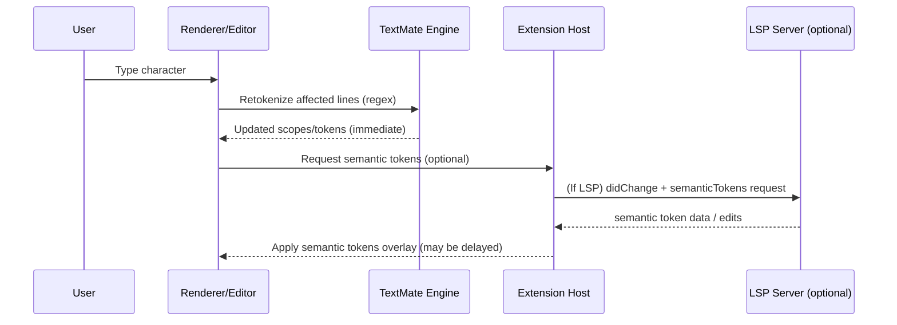
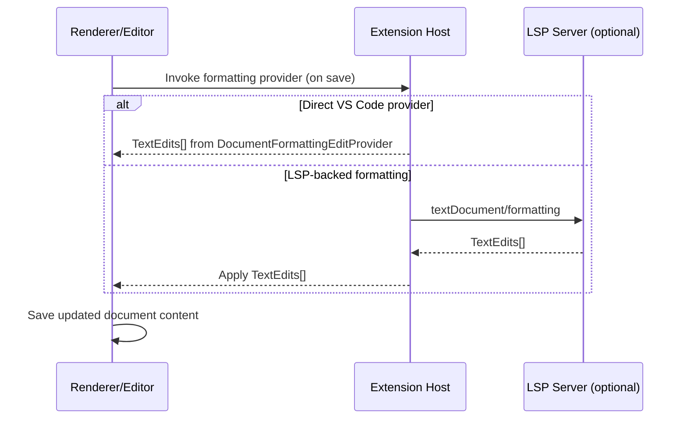

# VS Code internals: a deep architectural reference for language extension authors

VS Code's language extension system is a multi-layered machine where **isolated processes communicate through typed RPC**, text is stored in a red-black-tree-backed piece table, tokens are packed into 32-bit integers, and language features flow through a provider scoring system that bridges extension code to the editor's rendering pipeline. This report maps every component relevant to building a language extension — from the Electron process model down to how a single keystroke propagates through tokenization, language server protocol, diagnostics, and finally onto screen as colored, decorated text. The running example throughout is an indentation-sensitive DSL, which stress-tests nearly every subsystem.

---

## 1. The multi-process architecture that keeps extensions from crashing the UI

VS Code runs as a constellation of cooperating processes, a design born from one non-negotiable requirement: **no extension may ever block typing or scrolling**.

The **main process** (Electron's main, entry point at `src/vs/code/electron-main/`) handles window lifecycle, native OS menus, dialogs, and process orchestration. It spawns every other process, manages the `ElectronIPCServer`, and creates `UtilityProcess` instances for extension hosts. It runs no extension code and renders no UI.

The **renderer process** (one per window, entry at `src/vs/workbench/browser/web.main.ts`) hosts the Monaco editor, all panels, sidebars, and the full DOM-based UI. Since the 2023 sandbox migration, the renderer has **no direct Node.js access** — it communicates with other processes exclusively through `MessagePort` channels. A `vscode-file` custom protocol replaces `file://` for resource loading, and a preload script (`src/vs/base/parts/sandbox/electron-browser/preload.js`) exposes a minimal bridge via Electron's context isolation.

**Extension Host processes** are where all extension code runs. Three variants exist, selected by context:

| Kind | Class | Transport | Context |
|------|-------|-----------|---------|
| `LocalProcess` | `LocalProcessExtensionHost` | Electron UtilityProcess + MessagePort | Desktop |
| `LocalWebWorker` | `WebWorkerExtensionHost` | `postMessage` / `MessageChannel` | vscode.dev, browser |
| `Remote` | `RemoteExtensionHost` | TCP socket to VS Code Server | SSH, Containers, WSL |

On desktop, extension hosts are spawned as **Electron UtilityProcess** instances — a process type the VS Code team contributed to Electron specifically for this purpose. These support full Node.js, child process spawning, and direct MessagePort IPC with the sandboxed renderer, bypassing the main process entirely.

Communication uses a **custom typed RPC protocol**, not raw JSON-RPC. The renderer exposes `MainThread*` actors; the extension host exposes `ExtHost*` actors. Every interface is defined in `src/vs/workbench/api/common/extHost.protocol.ts` with naming conventions like `MainThreadLanguageFeaturesShape` and `ExtHostDocumentsShape`. Method names use a `$` prefix (`$acceptModelChanged`, `$registerCompletionSupport`). The `RPCProtocol` class handles message framing, request/response correlation, and proxy creation. For large payloads, `SerializableObjectWithBuffers` enables efficient binary transfer of `Uint8Array` data alongside JSON messages.

Extensions cannot touch the DOM because they literally run in a different operating system process. This isolation delivers five guarantees: **performance** (VS Code continuously optimizes DOM usage without fear of extension interference), **stability** (a misbehaving extension cannot freeze the UI — only the extension host watchdog notices), **consistency** (built-in UI components ensure uniform UX), **security** (reduced attack surface), and **portability** (the same extension API works on desktop, web, and remote targets).

### Extension Host lifecycle: activation and deactivation

Extensions load lazily. At startup, VS Code reads all `package.json` manifests and processes contribution points (commands, menus, grammars) without loading any extension code. The `AbstractExtensionService` (`src/vs/workbench/services/extensions/common/abstractExtensionService.ts`) dispatches activation events — `onLanguage:mydsl`, `onCommand:xxx`, `workspaceContains:**/*.mydsl`, or `*` for eager activation. Since VS Code 1.74, commands in `contributes.commands` and languages in `contributes.languages` implicitly generate activation events. Inside the extension host, `AbstractExtHostExtensionService` loads the extension module, resolves dependencies via the `ExtensionsActivator`, and calls the extension's exported `activate(context)` function. Deactivation occurs on shutdown or disable, calling `deactivate()` if exported. An unresponsive extension host triggers automatic CPU profiling — the watchdog logs which extension consumed the most CPU (e.g., `'eamodio.gitlens' took 78% of 5996ms`), and after three crashes in five minutes, a user notification appears.

### Web worker extension host

For vscode.dev, there is no native process. Web extensions declare a `browser` entry point and run inside a `WebWorkerExtensionHost`. Since web workers cannot create nested workers, VS Code uses a clever workaround: it starts a hidden iframe, which spawns the web worker and passes back a `MessagePort` for communication. The API surface is the same, but capabilities are reduced — no child process spawning, no `fs` module.

---

## 2. Documents live in a piece table backed by a red-black tree

### TextModel: the canonical document representation

`TextModel` (`src/vs/editor/common/model/textModel.ts`, ~2,700 lines) is the central class for open documents. It implements `ITextModel` and delegates text storage to an `ITextBuffer` (the piece tree), undo/redo to `EditStack`, tokenization to `TokenizationTextModelPart`, bracket pairs to `BracketPairsTextModelPart`, and decorations to `IntervalTree`-based `DecorationsTrees`. Key thresholds: **50 MB** sync limit to extension host, **20 MB** large-file threshold, **300,000 lines** large-file line count limit.

Two version IDs track document state. The `versionId` monotonically increases on every edit and never goes backward. The `alternativeVersionId` tracks position in the undo stack — it decreases on undo and re-advances on redo. The dirty state is computed by comparing `alternativeVersionId` to its value at last save, which means undoing to the saved state makes a file clean again. This logic lives in the workbench layer (`TextFileEditorModel`), not in TextModel itself.

### The piece table: why VS Code abandoned line arrays

Until 2018, VS Code stored text as an array of `ModelLine` objects. A **35 MB file with 13.7 million lines consumed ~600 MB** because each line carried ~40-60 bytes of JavaScript object overhead. Inserting a line required splicing the entire array — O(N). Opening large files hit V8's 256 MB string length limit.

The replacement is a **piece table** with a red-black tree, described in Peng Lyu's March 2018 blog post and implemented across four files in `src/vs/editor/common/model/pieceTreeTextBuffer/`. The data structure has two components:

**Buffers** are immutable or append-only strings. The **original buffers** are the file content as read from disk in **64 KB chunks** — VS Code does not concatenate them, avoiding the V8 string limit entirely. The **change buffer** is a single append-only string receiving all user-typed text.

**Pieces** are descriptors referencing spans within buffers:

```
class Piece {
    bufferIndex: number;      // which buffer
    start: BufferCursor;      // {line, column} within buffer
    end: BufferCursor;        // {line, column} within buffer
    lineFeedCnt: number;      // line feeds in this piece
    length: number;           // character count
}
```

Each `BufferCursor` references a `lineStarts` array on the buffer (precomputed positions of every `\n`), so line-based lookups skip entire pieces in O(log N). The document's logical text is the in-order traversal of pieces in a **red-black tree** (`rbTreeBase.ts`), where each `TreeNode` stores `size_left` (total character count of left subtree) and `lf_left` (total line feed count of left subtree). This enables O(log N) offset-to-position and line-number lookups by walking from root, comparing against subtree metadata at each node.

**Performance results**: memory usage dropped to **~1× file size** (from ~20×). Random edits are O(log N) regardless of file size. The trade-off is `getLineContent()` becoming O(log N) instead of O(1), but profiling showed this accounts for less than 1% of rendering time. A `PieceTreeSearchCache` stores recently accessed `{node, nodeStartOffset, nodeStartLineNumber}` tuples to accelerate sequential access patterns.

CRLF handling is notoriously complex. On every edit, the piece tree checks whether the edit splits an existing `\r\n` sequence or creates a new one by abutting `\r` and `\n` across piece boundaries. An `_EOLNormalized` flag tracks whether all line endings have been normalized.

### Edits, undo, and redo: no OT, no CRDT

VS Code does **not** use operational transforms or CRDTs — it is a single-user editor where edits are serialized. `TextModel.applyEdits()` validates ranges, sorts edits, and calls into the piece tree. For insertions, new text is appended to the change buffer, the containing piece is split, and a new tree node is inserted with red-black rebalancing. For deletions, piece boundaries are adjusted. The method returns **inverse operations** — the exact `TextChange[]` array needed to undo the edit.

The `EditStack` (`src/vs/editor/common/model/editStack.ts`) stores these inverse changes in `SingleModelEditStackElement` objects pushed to the global `IUndoRedoService`. On undo, the stored inverse changes are applied as regular edits; on redo, the forward changes are re-applied. For memory efficiency, `SingleModelEditStackData` can serialize to a compact `Uint8Array` binary format and deserialize on demand. Cross-file edits (rename refactoring) use `MultiModelEditStackElement` containing an array of single-model elements.

---

## 3. Tokenization: from TextMate grammars to 32-bit encoded tokens

### The vscode-textmate engine and WASM Oniguruma

VS Code's primary tokenization engine is the `vscode-textmate` library (github.com/microsoft/vscode-textmate), which executes TextMate grammars — collections of Oniguruma regular expressions organized into rules (`MatchRule`, `BeginEndRule`, `BeginWhileRule`). The `Registry` class manages grammar loading, dependency resolution, and theme configuration. When a grammar includes another via `{ "include": "source.js" }`, the registry recursively loads the referenced grammar.

Oniguruma regex matching runs through `vscode-oniguruma`, a **WASM port** of the C library. WASM was chosen over the previous `node-oniguruma` native addon for three reasons: cross-platform portability (works in both Electron and browsers), no native compilation needed, and a measured **~2.9× speedup** on large TypeScript files (PR #95958: 15,990ms → 5,551ms on `checker.ts`). The `OnigScanner` class takes an array of patterns and scans for the first match among them — the core primitive for TextMate rule competition at each character position.

### The 32-bit token metadata encoding

Since VS Code 1.9 (February 2017), tokens are **not** stored as objects with string arrays. They are packed into `Uint32Array` buffers using a carefully designed bit layout:

```
bbbb bbbb bfff ffff ffFF FTTT LLLL LLLL
```

- **Bits 0–7**: Language ID (8 bits, 256 languages)
- **Bits 8–10**: Standard token type (3 bits: Other, Comment, String, RegEx)
- **Bits 11–13**: Font style (3 bits: Italic, Bold, Underline as flags)
- **Bits 14–22**: Foreground color index (9 bits, 512 colors)
- **Bits 23–31**: Background color index (9 bits, 512 colors)

Tokens for each line are stored as `Uint32Array` pairs: even indices hold the token start offset, odd indices hold the 32-bit metadata. A line like `function f1() {` with Monokai theme produces just **96 bytes** versus 648+ bytes for the old object representation. Consecutive tokens with identical metadata are collapsed. Colors are indices into a **color map** — an array of unique hex strings generated when the theme loads. This design was driven specifically by the minimap, which needs to know token colors in JavaScript to paint a canvas.

### Line-by-line tokenization with immutable state stacks

Tokenization runs line by line, top to bottom. The `StateStack` is an **immutable linked list** representing parser state at line end. Each element stores a parent reference, scope name, and pre-computed 32-bit metadata. The `INITIAL` constant starts the first line. Each call to `tokenizeLine2()` takes the previous line's end state and returns a new `StateStack` plus the binary token array.

The critical optimization: when a scope is pushed, the **theme trie is consulted immediately** and fully resolved metadata is stored on the stack element. When popping, the parent's stored metadata is simply reused — O(1) per operation.

### Incremental re-tokenization on edits

When a line changes, `tokenizationTextModelPart.ts` re-tokenizes it and compares the resulting end-state to the previously stored end-state. If they match (the common case for single-line edits), no further lines need processing. If they differ (e.g., opening a multi-line comment), re-tokenization cascades downward until states converge. Non-visible lines are processed in **idle callbacks**, yielding to the event loop between chunks to maintain responsiveness. Lines longer than `editor.maxTokenizationLineLength` (default 20,000 characters) skip tokenization entirely. Files exceeding `editor.largeFileOptimizations` thresholds disable it altogether.

### Theme scope resolution via trie

Theme rules are compiled into a **trie** (`ThemeTrieElement` in `vscode-textmate/src/theme.ts`). A rule like `{ scope: "constant.numeric", foreground: 5 }` becomes a node at `constant → numeric` in the trie. Matching a scope stack like `["source.js", "constant.numeric.hex"]` walks the trie, with deeper scope matches taking priority, longer prefixes winning ties, and parent selectors (e.g., `source constant`) providing additional specificity. Child nodes inherit unset properties from parents during trie construction.

### Semantic tokens overlay syntactic tokens

Since VS Code 1.43, `DocumentSemanticTokensProvider` enables language servers to provide richer token information. Semantic tokens use a **5-integer-per-token** delta-encoded `Uint32Array`: `deltaLine`, `deltaStart`, `length`, `tokenType` (index into a legend), and `tokenModifiers` (bitmask). Delta edits express changes as splice operations on the integer array.

**Semantic tokens overlay syntactic tokens** — they always win when present. TextMate highlighting shows immediately on file open; semantic tokens arrive asynchronously and enrich the display. Themes must opt in via `"semanticHighlighting": true`. Each semantic token type has a fallback mapping to TextMate scopes, so themes without explicit semantic rules still benefit. Standard types include `variable`, `function`, `class`, `parameter`, `property`; standard modifiers include `readonly`, `static`, `deprecated`, `async`, `declaration`.

---

## 4. Language feature providers: registration, scoring, and the request lifecycle

### The provider pattern

Every language feature in VS Code follows a uniform **provider interface**: an object with a method like `provideCompletionItems(document, position, token, context)` that returns `ProviderResult<T>` — either a value, `undefined`/`null`, or a `Thenable` of these. Every method receives a `CancellationToken` as a parameter.

Registration uses `vscode.languages.register*Provider(selector, provider)`, which returns a `Disposable`. Internally, `ExtHostLanguageFeatures` (extension host side) assigns a numeric handle, stores the provider, and calls the main thread proxy — e.g., `$registerCompletionSupport(handle, selector, triggerCharacters, supportsResolve)`. The `MainThreadLanguageFeatures` class receives this RPC call and registers an adapter with `ILanguageFeaturesService`, which maintains a `LanguageFeatureRegistry<T>` per feature type.

### Provider scoring determines who answers

The `languages.match(selector, document)` function computes a numeric score. A `DocumentFilter` with `language`, `scheme`, and `pattern` fields scores **10** for exact matches and **5** for wildcards. The maximum across all filter entries in a `DocumentSelector` is taken. Provider selection strategy varies by feature:

- **Best match only** (formatting, rename, semantic tokens): highest-scoring provider is used exclusively
- **Sequential by score groups** (completions, document highlights): groups asked in order until one returns results
- **Parallel, merged** (definition, references, implementation): all matching providers called simultaneously, results merged
- **All providers** (hover): every matching provider contributes

When scores tie, the **last registered** provider wins — giving extensions that activate later implicit priority.

### The completion lifecycle, step by step

A user types `.` (trigger character) → VS Code creates a `CompletionContext` with `triggerKind: TriggerCharacter` → the `LanguageFeatureRegistry` scores all completion providers against the document → providers are called in score-group order via the RPC boundary → extension host deserializes the call, invokes `provideCompletionItems`, serializes results via `extHostTypeConverters.ts` → main thread receives the `CompletionList`, renders the IntelliSense widget. If the user continues typing before results arrive, the `CancellationToken` is cancelled, and the in-flight request is abandoned. Results are cached until the context changes or the `isIncomplete` flag forces a re-request.

The **resolve pattern** enables lazy loading: `CompletionItem.resolve()` is called only when a user highlights a specific item, allowing the server to defer expensive `documentation` and `additionalTextEdits` computation. This same pattern applies to `CodeAction.resolve()`, `CodeLens.resolve()`, and `DocumentLink.resolve()`.

### Three flavors of formatting

`DocumentFormattingEditProvider` handles whole-document formatting (Shift+Alt+F). `DocumentRangeFormattingEditProvider` handles selection formatting. `OnTypeFormattingEditProvider` triggers on specific characters (e.g., `}`, `;`, `\n`). The critical requirement: formatters must return the **smallest possible text edits** so that diagnostic markers, breakpoints, and other range-tracked state survive the edit.

---

## 5. Language Server Protocol: JSON-RPC over stdio, sockets, or pipes

### The transport stack

The `microsoft/vscode-languageserver-node` monorepo provides six coordinated npm packages. At the base, `vscode-jsonrpc` implements the transport: messages use HTTP-like headers (`Content-Length: 234\r\n\r\n`) followed by a UTF-8 JSON-RPC 2.0 body. Three message types exist: **requests** (have `id` + `method`), **responses** (have `id` + `result`/`error`), and **notifications** (have `method`, no `id`).

Four transports are available via `TransportKind`:

- **`stdio`**: server reads stdin, writes stdout. Universal, works with any language runtime. The server must avoid writing debug output to stdout.
- **`ipc`**: Node.js IPC channel via `process.send`. Faster than stdio, recommended for Node.js servers, leaves stdout/stderr free for logging.
- **`pipe`**: named pipes (Windows) or Unix domain sockets. Connects to already-running servers.
- **`socket`**: TCP on a port. Network-capable, suitable for Docker/remote scenarios.

### Server lifecycle and capability negotiation

The lifecycle follows a strict sequence: `initialize` request → `initialized` notification → normal operation → `shutdown` request → `exit` notification. The `InitializeParams` carries the client's PID, workspace root URI, workspace folders, and a `capabilities` object declaring what the editor supports (snippet completions, workspace edits with resource operations, semantic tokens, etc.). The server responds with `InitializeResult` containing `ServerCapabilities` — a declaration of every feature the server provides (`completionProvider`, `hoverProvider`, `textDocumentSync`, `diagnosticProvider`, etc.).

**Dynamic capability registration** (LSP 3.x) allows servers to register or unregister capabilities at runtime via `client/registerCapability` and `client/unregisterCapability`, each with a unique `id`. This enables servers that discover capabilities incrementally — for instance, enabling formatting support only after loading a project's configuration.

### Document synchronization: full vs. incremental

`TextDocumentSyncKind` controls how document content reaches the server. With **Full** sync (value `1`), the entire document text is sent on every change — simple but wasteful. With **Incremental** sync (value `2`), only changed ranges are sent as `TextDocumentContentChangeEvent` objects containing `{ range: {start, end}, text }`. The `vscode-languageclient` automatically translates VS Code's internal edit events to LSP-compatible format. The notification sequence is `didOpen` (full content + version) → `didChange` (deltas) → `didSave` (optionally with full text) → `didClose`.

### The middleware pattern and error handling

`LanguageClientOptions.middleware` lets extensions intercept and modify every LSP request/response cycle. Each middleware function receives the original parameters and a `next` function that invokes the default implementation. This enables pre-processing parameters, post-processing results, filtering diagnostics, or short-circuiting requests entirely — a pattern used extensively in embedded language scenarios where requests must be forwarded to different servers depending on cursor position.

The default error handler restarts the server on crash, unless it has crashed **5+ times in the last 3 minutes**. The `LanguageClient` class (`start()` → spawn + initialize + register features; `stop()` → shutdown + exit) handles the full lifecycle, including `protocol2CodeConverter` and `code2ProtocolConverter` for type translation between LSP and VS Code API types.

---

## 6. From tokens to pixels: the decoration and rendering pipeline

### MVVM architecture with virtualized rendering

Monaco uses a **Model-View-ViewModel** pattern. The **Model** (`TextModel`) holds view-independent content, tokens, and decoration metadata. The **ViewModel** (`ViewModelImpl`) handles tab-to-column conversion, word wrapping, code folding, and coordinate transforms between model and view positions. The **View** renders DOM elements — but only for visible lines.

The editor employs **virtualized rendering**: only lines within the viewport (plus a small buffer) exist as DOM nodes. Each visible line is a `ViewLine` — a `<div>` containing `<span>` elements for individual tokens. On scroll, lines leaving the viewport are recycled: their DOM elements are updated with new content rather than destroyed and recreated. The `ScrollableElement` component manages scroll position with `overflow: hidden` clipping.

### Tokens become CSS classes, not inline styles

The 32-bit token metadata contains foreground color **indices**. At theme load time, VS Code generates CSS rules for each color in the color map:

```css
.mtk1 { color: #F8F8F2; }
.mtk9 { color: #F92672; }
.mtki { font-style: italic; }
.mtkb { font-weight: bold; }
```

A tokenized line renders as `<span class="mtk9 mtki">function</span><span class="mtk1"> </span><span class="mtk5">f1</span>`. This is vastly more efficient than the pre-1.9 approach of scope-derived class names with CSS specificity matching — the class names are trivially small and generated from simple integer arithmetic.

### The decoration system

Four decoration types serve different visual needs. **Inline decorations** style text within lines (foreground, background, border, before/after pseudo-elements). **Line decorations** affect entire lines (gutter icons, line backgrounds). **Overview ruler decorations** place colored markers on the scrollbar. **Minimap decorations** render in the minimap canvas. Decorations are created via `editor.deltaDecorations(oldIds, newDecorations)` — an atomic batch operation. Decoration ranges auto-adjust on edits via configurable `TrackedRangeStickiness`.

### The minimap is a canvas, not DOM

The minimap renders to a `<canvas>` element using pre-baked character pixel data (`minimapPreBaked.ts`). `MinimapCharRenderer` paints individual characters; `MinimapTokensColorTracker` maps token color indices to RGB values. This canvas-based approach was the original motivation for the 1.9 tokenization rewrite — the minimap needs to know token colors in JavaScript, which the old scope-string-based system couldn't provide efficiently.

### ViewParts compose the editor

The View is composed of **~20 ViewParts** (`src/vs/editor/browser/viewParts/`), each responsible for one visual element: `contentWidgets/` (IntelliSense popups), `minimap/`, `lineNumbers/`, `decorations/`, `viewCursors/`, `selections/`, `glyphMargin/`, `indentGuides/`, `overviewRuler/`, `viewLines/` (the main text content), and more. Each ViewPart subscribes to ViewModel events and only re-renders when relevant data changes. Features in `editor/contrib/` compose ViewParts — the Find Widget uses an overlay widget plus multiple decorations. VS Code is also exploring **GPU-accelerated rendering** via WebGL (`src/vs/editor/browser/gpu/`), using cell buffers that track dirty lines.

---

## 7. Contribution points and grammar discovery: how package.json drives everything

### Language registration and grammar loading

The `contributes.languages` entry registers a language ID with file associations (`extensions`, `filenames`, `firstLine` regex pattern), display names (`aliases`), and a path to `language-configuration.json`. The `contributes.grammars` entry links a grammar file to a language via `scopeName` — the globally unique TextMate scope identifier (convention: `source.*` for code, `text.*` for markup). Grammar files can be `.tmLanguage.json` (recommended), `.tmLanguage` (XML plist), or `.plist`.

Grammars are loaded **lazily**. At startup, VS Code reads all `contributes.grammars` entries and builds a `scopeName → file path` lookup map without loading any grammar files. On first use (when a file of that language opens), `Registry.loadGrammar(scopeName)` triggers, loading the grammar file, resolving all `include` dependencies recursively, compiling rules, and caching in the `SyncRegistry`.

**Embedded languages** use the `embeddedLanguages` map: `{"meta.embedded.block.javascript": "javascript"}` tells VS Code that tokens inside that scope should use JavaScript's comment toggling, snippets, and bracket matching. **Grammar injection** (`injectTo: ["source.js"]`) extends existing grammars without modifying them. The `injectionSelector` in the grammar file controls injection priority: `L:` prefix means injected rules are tried before existing rules, `R:` means after.

### Language configuration drives editing behavior

The `language-configuration.json` file controls bracket matching (`brackets`), comment toggling (`comments.lineComment`, `comments.blockComment`), auto-closing pairs (`autoClosingPairs` with `notIn` context), surrounding pairs, word pattern, and critically for indentation-sensitive languages, **indentation rules** and **onEnterRules**.

`indentationRules` define regex patterns: `increaseIndentPattern` matches lines after which indent should increase (e.g., lines ending with `:`), and `decreaseIndentPattern` matches lines that should decrease indent. `onEnterRules` provide finer control over Enter key behavior with `beforeText`/`afterText`/`previousLineText` regex patterns and actions (`indent`, `outdent`, `indentOutdent`, `none`).

For **indentation-based folding**, setting `folding.offSide: true` tells VS Code to compute folding regions from indentation: a region starts where a line has less indent than following lines and ends at a line with equal or less indent. This works naturally for Python, YAML, and similar languages.

### Activation events and dependency resolution

Extension activation is lazy. Available triggers include `onLanguage:mydsl`, `onCommand:xxx`, `workspaceContains:**/*.mydsl`, `onFileSystem:scheme`, and `onStartupFinished` (preferred over `*`). Since VS Code 1.74, many activation events are implicitly inferred from contribution points. The `extensionDependencies` field ensures dependent extensions are installed and loaded first, but does not guarantee they are *activated* — check `vscode.extensions.getExtension("id").isActive` if needed.

---

## 8. Events, disposables, and how state changes cross the process boundary

### The Emitter/Event pattern

VS Code's event system is built on `Emitter<T>` and `Event<T>` (`src/vs/base/common/event.ts`). The owner creates a private `Emitter`, exposes its `.event` property publicly, and calls `fire(data)` to notify listeners. Listeners subscribe by calling the `Event` function, receiving an `IDisposable` for cleanup. The `Emitter` includes leak detection — if listener count exceeds a threshold squared, it **refuses new listeners entirely**.

Rich composition utilities exist: `Event.map`, `Event.filter`, `Event.debounce` (with configurable merge function), `Event.buffer` (queue events until manual flush), `Event.once` (auto-dispose after first fire), `Event.any` (merge multiple events), and `Event.accumulate` (collect events over a delay period into arrays).

### How document changes reach extensions

When a user types in the editor: (1) `TextModel` fires `onDidChangeContent` via `DidChangeContentEmitter`, batching multiple changes within a single edit into one event. (2) `MainThreadDocuments` serializes the changes via `$acceptModelChanged()` across the RPC boundary. (3) `ExtHostDocuments` receives the deserialized event, updates its internal `ExtHostDocumentData` mirror, and fires `workspace.onDidChangeTextDocument` wrapping data in the public `TextDocumentChangeEvent` type. Type conversion between 1-based internal positions and 0-based API positions happens in `extHostTypeConverters.ts`.

### The Disposable pattern

`IDisposable` (`src/vs/base/common/lifecycle.ts`) is the fundamental resource management pattern. `Disposable` (abstract base class) provides `_register<T extends IDisposable>(t: T)` to auto-dispose children. `DisposableStore` manages sets of disposables. `MutableDisposable<T>` holds a single swappable disposable where setting `.value` disposes the previous. Every event subscription, every provider registration, and every decoration type returns a `Disposable` that must be tracked — typically via `context.subscriptions.push()` in the extension's `activate()` function.

---

## 9. The vscode API surface: what extensions can and cannot do

The `vscode` module that extensions import is constructed per-extension by `createApiFactoryAndRegisterActors` in `src/vs/workbench/api/common/extHost.api.impl.ts`. Each extension gets a **scoped** API object. The factory creates all `ExtHost*` service instances, registers them with `RPCProtocol`, and returns a closure that produces the correctly scoped namespace.

The stable API is defined in `src/vscode-dts/vscode.d.ts` and published as `@types/vscode` on npm. The VS Code team maintains **strict backward compatibility** — existing APIs are never broken. The API is organized into namespaces: `vscode.languages` (providers, diagnostics), `vscode.window` (editors, UI), `vscode.workspace` (documents, configuration, file system), `vscode.commands`, `vscode.debug`, `vscode.extensions`, `vscode.env`, `vscode.authentication`, `vscode.tests`, and newer additions like `vscode.chat` and `vscode.lm`.

**Proposed APIs** live in `src/vscode-dts/vscode.proposed.*.d.ts` files. Extensions opt in via `enabledApiProposals` in `package.json`. A runtime check (`checkProposedApiEnabled`) prevents unauthorized use. Extensions using proposed APIs **cannot be published** to the Marketplace. The lifecycle: proposal issue → implementation → feedback → finalization → types move to stable `vscode.d.ts`.

Extensions face hard constraints: **no DOM access** (different process), **limited UI primitives** (TreeView, QuickPick, InputBox, StatusBar, Webview only), **no synchronous file I/O** (must use `vscode.workspace.fs`), **no direct service access** (only the `vscode` namespace), **no `file://` URI assumptions** (resources may be virtual), and web extensions cannot spawn child processes.

---

## 10. Diagnostics: from DiagnosticCollection to squiggly lines and the Problems panel

### Creating and managing diagnostics

`vscode.languages.createDiagnosticCollection(name)` creates a named collection backed by `IMarkerService` on the main thread. Each `Diagnostic` object has a `range`, `message`, `severity` (Error, Warning, Information, Hint), optional `code` (linkable via `{value, target}`), `source` string, `relatedInformation` array, and `tags` (Unnecessary for fade-out, Deprecated for strikethrough). The collection's `set(uri, diagnostics[])` replaces all diagnostics for a URI, crossing the RPC boundary to `MainThreadDiagnostics` → `IMarkerService.changeOne()`.

### How diagnostics are displayed

**Squiggly underlines** are implemented as editor decorations with wavy underlines colored by severity: red for errors (`editorError.foreground`), yellow for warnings, blue for information, and three-dot ellipsis for hints. The **Problems panel** (`src/vs/workbench/contrib/markers/`) groups diagnostics by file, shows severity icons, message, source, and line number, with filtering by text and severity. **Minimap markers** render colored highlights. The **status bar** shows aggregated error/warning counts via `MarkerStats`, which subscribes to `IMarkerService.onMarkerChanged` and uses `MicrotaskEmitter` with a merge function that deduplicates URIs for event batching.

### LSP diagnostics map through the client

When `vscode-languageclient` receives a `textDocument/publishDiagnostics` notification, the `DiagnosticsFeature` converts LSP types to VS Code types via `protocol2CodeConverter`, optionally passes through `middleware.handleDiagnostics`, and calls `DiagnosticCollection.set()`. **Pull diagnostics** (LSP 3.17) reverse the flow: the client requests `textDocument/diagnostic`, the server responds with `DocumentDiagnosticReport` (either `full` or `unchanged` with `resultId`), and the server can trigger re-pulls via `workspace/diagnostic/refresh`.

`CodeActionProvider` integrates with diagnostics by receiving a `CodeActionContext` containing the diagnostics at the requested range. Quick fixes (`CodeActionKind.QuickFix`) reference specific diagnostics, enabling the lightbulb icon to appear with targeted fixes.

---

## 11. Webviews run in sandboxed iframes with message passing

Webviews are `<iframe>` elements (replacing Electron's deprecated `<webview>` tag) with separate browsing contexts. On desktop, content is served from a randomly generated `vscode-webview://` origin. Extensions set Content Security Policy via `<meta>` tags and control JavaScript execution via `enableScripts` (default false) and file access via `localResourceRoots`.

Communication is bidirectional: the extension calls `panel.webview.postMessage(data)`, the webview calls `vscode.postMessage(data)` (using the API acquired via `acquireVsCodeApi()`, callable only once). Messages must be JSON-serializable; `ArrayBuffer` values are efficiently transferred since VS Code 1.57. The webview maintains state via `vscode.getState()`/`vscode.setState()` (in-memory, survives hide/show) and `WebviewPanelSerializer` (survives VS Code restart).

Custom editors come in three types: `CustomTextEditorProvider` (uses standard `TextDocument` as backing model, gets free undo/redo), `CustomReadonlyEditorProvider` (extension provides its own document model), and `CustomEditorProvider` (full control over editing, saving, undo/redo).

---

## 12. Performance architecture: how VS Code stays responsive at scale

### Extension host isolation is the foundation

The fundamental guarantee: extensions cannot block typing or scrolling. Even an infinite loop in an extension only freezes the extension host — the renderer continues functioning. The extension host watchdog monitors responsiveness via heartbeat, auto-profiles CPU on hangs, identifies the offending extension by CPU percentage, and saves profiles to temp directories. If the host terminates unexpectedly three times in five minutes, a user notification appears offering to disable suspect extensions.

### Tokenization yields to the event loop

TextMate tokenization runs on the UI thread in a **yielding fashion**, processing batches of lines and yielding via idle callbacks. Non-visible lines are deferred. VS Code is actively migrating tokenization to web workers (`textMateWorkerHost.ts`) to eliminate UI-thread impact entirely — the UI remembers the last N edits until confirmed by the worker. Lines exceeding `editor.maxTokenizationLineLength` (20,000 chars) are skipped. Files exceeding `editor.largeFileOptimizations` thresholds disable tokenization entirely.

### Every language feature is async with cancellation

All provider interfaces return `Promise` or `Thenable`. Every call includes a `CancellationToken` that VS Code cancels when the result becomes irrelevant (user keeps typing, widget dismissed). The resolve pattern defers expensive computation until the user actually inspects a specific result. LSP communication is inherently async over stdout/sockets.

### Extension Bisect uses binary search

The "Extension Bisect" tool (`Help: Start Extension Bisect`) uses **O(log N) binary search** — disabling half the extensions, asking if the issue persists, then bisecting the remaining half. With 24 extensions, it finds the culprit in 4-5 steps versus 24 with linear search.

### Memory management for large files

The piece table stores text at ~1× file size. Virtualized rendering keeps DOM node count constant regardless of file length. The minimap renders to a canvas, not DOM. V8 code caching is enabled with `bypassHeatCheck` forcing optimization on first load for VS Code's ~11.5 MB minified workbench script. `VSBuffer` wraps `Uint8Array` for efficient binary data across processes.

---

## Putting it all together: building a language extension for an indentation-sensitive DSL

An indentation-sensitive DSL stress-tests VS Code's architecture because TextMate grammars are fundamentally **line-based and cannot track indent levels**. Here is how each system contributes and where the extension author hooks in:

**Package.json** registers `contributes.languages` (with `.mydsl` extension, language ID, and `language-configuration.json` path), `contributes.grammars` (linking `source.mydsl` scopeName to a `.tmLanguage.json` file), and `contributes.configuration` (extension settings like indent size). `configurationDefaults` sets `"[mydsl]": { "editor.tabSize": 4, "editor.insertSpaces": true }`.

**Language configuration** sets `folding.offSide: true` for indentation-based folding, defines `onEnterRules` matching lines ending with `:` (action: `indent`) and lines starting with `return`/`break` (action: `outdent`), and specifies `indentationRules` for reindentation commands. The limitation: regex-based rules see only the current line (and optionally the line above), making multi-line expressions unreliable.

**The TextMate grammar** handles per-line lexical tokenization — keywords, strings, comments, operators — but cannot create nested scopes reflecting indent hierarchy. The workaround: accept flat tokenization for the fast-path baseline and delegate structural understanding to the language server.

**The language server** (connected via `vscode-languageclient` with `TransportKind.ipc` for Node.js or `TransportKind.stdio` for other runtimes) provides accurate folding ranges based on full-document parsing, diagnostics (published via `textDocument/publishDiagnostics`), completions scoped to the current indent context, go-to-definition across the AST, and semantic tokens that overlay richer type information onto TextMate's lexical tokens.

**The data flow when a user types a colon after `if x > 0`**: (1) keystroke reaches the renderer → piece table inserts `:` into the change buffer → `TextModel` fires `onDidChangeContent` → (2) tokenization re-runs on the edited line using the previous line's `StateStack`, comparing end-states to determine cascade → (3) the change propagates via `$acceptModelChanged()` to the extension host → (4) the language client sends `textDocument/didChange` (incremental sync, just the `:` character) to the language server → (5) the server re-parses, detects the new `if` block, publishes diagnostics and updated semantic tokens → (6) diagnostics arrive as `textDocument/publishDiagnostics`, flow through `DiagnosticCollection.set()` → `IMarkerService.changeOne()` → squiggly underlines render as decorations → (7) semantic tokens arrive, merge with TextMate tokens, and the affected ViewLines re-render with updated `mtk*` CSS classes → (8) the user presses Enter, `onEnterRules` match the `:` ending, and the new line is auto-indented.

This dual-layer architecture — fast line-based TextMate tokenization for instant visual feedback, plus asynchronous language server intelligence for structural accuracy — is VS Code's deliberate design for language extensions. The process isolation, piece table efficiency, binary token encoding, and provider scoring system all exist to make this pipeline feel instantaneous, even for complex languages where understanding indentation requires parsing the entire document.


-------------------


# VS Code Extension Architecture and Language Feature APIs for a Custom DSL

## Executive summary

VS Code’s language features are delivered through a **multi-process / multi-runtime architecture**: the editor UI (renderer) performs fast, local operations like **TextMate tokenization**, while extension code runs in an **extension host** (Node.js on desktop/remote, **Browser WebWorker** on the web) and can optionally communicate with an external **Language Server (LSP)**. The official docs emphasize that TextMate tokenization **runs in the renderer process and updates as the user types**, while **semantic tokens** are an overlay that may arrive later because language servers can take time to initialize and analyze a project. citeturn12view0turn8search2

For an indentation-sensitive, Python-like DSL (details like target OS versions, exact Node/Python/Rust versions, file extension, and whether web support is required are **unspecified**), the VS Code platform gives you three “layers” you can combine:

1. **Declarative editor scaffolding** via `language-configuration.json` (indentation rules, `onEnterRules`, brackets, folding markers, auto-closing pairs). This ships without runtime code and supports core UX like bracket matching and indentation-based folding. citeturn16view0turn16view1turn16view4  
2. **Lexical syntax highlighting** via **TextMate grammars** (regex-based, Oniguruma-powered) with configuration hooks for bracket participation. This is the fastest path to baseline colorization. citeturn12view0turn12view4  
3. **Programmatic “smart” features** either directly through VS Code provider APIs (e.g., `DocumentSemanticTokensProvider`, `DocumentFormattingEditProvider`, `FoldingRangeProvider`, `HoverProvider`) or indirectly through the **Language Server Protocol** (`textDocument/semanticTokens/*`, `textDocument/formatting`, `textDocument/foldingRange`, `textDocument/hover`, etc.). citeturn6view2turn7view0turn7view2turn13view2turn13view4turn13view5turn14view0  

The biggest architecture decision is **where your “truth” lives**:

- If you want a lightweight extension (and broad compatibility, including web), start with **TextMate + language configuration**, then optionally add a **semantic token provider** and formatter running inside the extension host. citeturn11search3turn12view0turn7view0  
- If you want long-term, reusable tooling and richer UX (hover, diagnostics, code actions, structure-aware folding), implement an **LSP server**. The LSP spec defines the lifecycle and capability negotiation (`initialize` → `InitializeResult.capabilities`) and provides standardized methods for most editor features. citeturn13view6turn13view7turn14view0turn13view5  
- If you need web-first support and/or non-JS server performance, VS Code supports **web LSP patterns** (LSP server running in a web worker) and provides official samples for **WASM-based language servers**. citeturn11search7turn20view0turn20view1turn22view0  

## VS Code runtime architecture and where language features run

VS Code uses an **extension host** concept to run extensions with stability and performance goals (preventing extensions from impacting startup, slowing UI operations, or modifying the UI directly), and extensions are lazily loaded via activation events. citeturn10view0

### Extension hosts and runtimes

The extension host guide enumerates multiple hosts depending on configuration:

- **local**: Node.js extension host on the same machine as the UI  
- **remote**: Node.js extension host running remotely (containers/SSH/WSL/Codespaces/etc.)  
- **web**: web extension host running in the browser (or locally) using a **Browser WebWorker runtime** citeturn10view0

It also explains the **runtime selection**: Node.js hosts use the `main` entry; the web extension host uses the `browser` entry. The preferred host can be influenced by `extensionKind`. citeturn10view0

### Renderer/editor process vs extension host process

VS Code’s sandboxing/multi-process architecture is discussed in Microsoft’s “process sandboxing” blog. It states that the **extension host** is a **process** that runs installed extensions **isolated from the renderer process**, and that there is one extension host per opened window. citeturn11search4

This separation is crucial for language tooling design:

- Anything that must feel instantaneous during typing (e.g., lexical tokenization) is favored to run in the renderer.  
- Anything heavier or project-aware (semantic tokens, diagnostics, indexing) belongs in the extension host or LSP server.

### Web extension host constraints

Web extensions run in a **Browser WebWorker** sandbox and have significant limitations compared to Node.js extensions. The web extensions guide notes that importing/requiring other modules is not supported and `importScripts` is not available; **code must be packaged to a single file**, and the VS Code API can be loaded via `require('vscode')`. citeturn11search7turn11search3

Also: extensions with only **declarative contributions** (no `main` or `browser`) can run in VS Code for the Web “without modifications,” with themes/grammars/snippets cited as examples. citeturn11search3

## Tokenization pipeline and syntax highlighting

VS Code describes syntax highlighting as two parts: **tokenization** and **theming**. Its tokenization engine is powered by **TextMate grammars**, a structured set of regex patterns written in plist or JSON. citeturn12view0

### TextMate grammars, Oniguruma, and the renderer

Key platform facts that shape performance and architecture:

- The **TextMate tokenization engine runs in the same process as the renderer**, and tokens are updated as the user types. citeturn12view0  
- TextMate grammars rely on **Oniguruma regular expressions**. citeturn12view0  
- Tokens aren’t only for coloring; they also classify source into regions like comments/strings/regex. citeturn12view0  

Operational implication (explicitly labeled): because tokenization runs in the renderer, **pathologically expensive regex grammars can cause UI jank** (this is an inference from where the work runs, not a verbatim platform warning). The official docs confirm the execution location and update cadence. citeturn12view0

### Libraries that implement VS Code’s TextMate stack

If you want to test or reproduce VS Code-like tokenization outside the editor, Microsoft maintains:

- `vscode-textmate`: “a library that helps tokenize text using TextMate grammars.” citeturn8search4  
- `vscode-oniguruma`: “Oniguruma bindings for VS Code,” used in VS Code, with WASM build steps explicitly described in the repo README. citeturn9view0  

These are relevant both for **unit testing** your grammar and for building **auxiliary tooling** (e.g., a CLI that checks highlighting regressions).

### Bracket matching behavior from token scopes

VS Code exposes two settings to control which token scopes participate in bracket matching:

- `balancedBracketScopes`: scopes that participate (default: all)  
- `unbalancedBracketScopes`: scopes excluded from bracket matching citeturn12view4turn12view5  

This matters for DSLs that contain bracket-like glyphs inside strings or patterns (e.g., `[` `]` inside docstrings) where bracket matching would be misleading.

### How a keystroke leads to updated highlighting

A practical, architecture-accurate flow looks like this:

1. A user types a character; the editor updates the buffer in the **renderer/editor process**.  
2. VS Code re-tokenizes affected regions using the **TextMate engine**; this happens in the renderer and updates as the user types. citeturn12view0  
3. If your language also provides **semantic tokens**, VS Code requests them from a semantic token provider (often backed by a language server). Semantic token highlighting is applied **on top** of TextMate highlighting and may appear after a short delay because the server can take time to load/analyze. citeturn12view0turn8search2  
4. If the semantic provider supports incremental updates (delta), VS Code can request/consume edits rather than full recomputation (details in the next section). citeturn6view3turn13view2  

## Semantic tokens and theming

Semantic tokens allow you to colorize based on deeper structure (“this identifier is a step name,” “this key is a declaration,” etc.). VS Code emphasizes that semantic highlighting is an **addition** on top of TextMate highlighting. citeturn8search2turn12view0

### VS Code API: `DocumentSemanticTokensProvider` and delta updates

The authoritative definition is in `vscode.d.ts`:

- `DocumentSemanticTokensProvider` returns tokens encoded as a compact integer array with **five integers per token**: `deltaLine`, `deltaStart`, `length`, `tokenType`, `tokenModifiers`. A token **cannot be multiline**. Token type and modifiers are interpreted against a `SemanticTokensLegend` (`tokenTypes` array; `tokenModifiers` bitset). citeturn6view2  
- Providers can optionally implement `provideDocumentSemanticTokensEdits(...)` to return **incremental edits** to a previously provided token array. If edits are too hard, the provider can “give up” and return full tokens again. citeturn6view3turn6view2  
- Providers are registered with `languages.registerDocumentSemanticTokensProvider(selector, provider, legend)`. citeturn6view4  

A performance-relevant nuance: VS Code also supports `DocumentRangeSemanticTokensProvider`. `vscode.d.ts` notes that if both range and full document providers exist, the **range provider may be invoked initially while the full provider resolves**, and then its tokens are discarded once full tokens arrive. citeturn6view4turn6view0  
This pattern is useful if you want fast “first paint” semantic coloring for visible ranges, then consistent full-document tokens for scrolling/minimap.

### LSP semantic tokens: `textDocument/semanticTokens/full` and `full/delta`

The LSP 3.17 spec standardizes semantic token requests and deltas:

- Full document: `textDocument/semanticTokens/full` returns `SemanticTokens | null` where `SemanticTokens.data` is a uinteger array. citeturn13view2turn13view1  
- Delta: `textDocument/semanticTokens/full/delta` returns token edits (`SemanticTokensEdit` with `start`, `deleteCount`, optional `data`). citeturn13view2turn13view3  
- Range: `textDocument/semanticTokens/range` exists and the spec explicitly discusses why servers might implement range for faster UI rendering on open, but also recommends implementing full to support flicker-free scrolling and minimap coloring. citeturn13view2turn13view1  

### Standard token types/modifiers and accessibility implications

VS Code comes with a standard set of semantic token types and modifiers and encourages providers to adhere to these classifications so theme authors can write rules that work across languages. Providers can define new types/modifiers and derived subtypes. citeturn8search2

Theme compatibility and accessibility depend on how semantic tokens map to themes:

- The VS Code Semantic Highlighting overview explains that themes may opt into semantic highlighting, can write semantic token rules, and if a theme **does not provide a semantic rule**, VS Code can fall back to a **mapping from semantic token classification to TextMate scopes** and look up colors in TextMate rules. citeturn15view0turn15view1  

Practical guidance for an accessible DSL highlighter (grounded in the platform mechanism): prefer standard token types/modifiers where possible so users’ existing themes have sensible defaults, and keep custom types to a minimum unless you also provide theme documentation.

### Official semantic token sample

Microsoft’s `semantic-tokens-sample` demonstrates a simple semantic token provider registered via `vscode.languages.registerDocumentSemanticTokensProvider` and uses `SemanticTokensLegend` + `SemanticTokensBuilder`. citeturn3search2turn23view0

## `language-configuration.json` features for indentation, brackets, and folding

VS Code’s language configuration file enables a wide range of **declarative** editing behaviors. The language configuration guide explicitly lists: comment toggling, brackets definition, auto-closing, auto-surrounding, folding, word pattern, and indentation rules. citeturn16view0

### Indentation behaviors and `onEnterRules`

For Python-like DSL ergonomics, two pieces are central:

- `onEnterRules`: evaluated when Enter is pressed; the guide shows a Python-like rule that indents after lines matching `...*?:\s*$` (e.g., `def ...:` / `class ...:`). It explains `beforeText`, `afterText`, and `previousLineText` matching and that the first matching rule wins. citeturn16view1  
- `indentationRules`: defines how indentation adjusts when typing, pasting, and moving lines. citeturn16view2  

For your DSL’s `header:` blocks, the Python-like colon-ending pattern in `onEnterRules` is directly applicable (surface details like exact keywords are unspecified). citeturn16view1

### Brackets: matching pairs and navigation

`language-configuration.json`’s `brackets` entry defines bracket pairs so VS Code can highlight matching brackets and support “Go to Bracket / Select to Bracket.” citeturn16view3  
Separately, TextMate scope-based bracket participation can be controlled with `balancedBracketScopes` / `unbalancedBracketScopes`. citeturn12view4

### Folding: indentation vs providers vs markers

The language configuration guide states folding is defined either:

- indentation-based (when no folding provider exists or `editor.foldingStrategy` set to `indentation`) and can be augmented with start/end regex markers in `folding.markers`, or  
- via a language server/provider responding to `textDocument/foldingRange`. citeturn16view4turn13view5  

For an indentation-sensitive DSL, indentation folding is often a strong default even before you have a real parser.

## Formatting, edits, and format-on-save flows

Formatting in VS Code should use the formal formatting APIs so users can trigger formatting through standard commands and settings (e.g., format-on-save). Microsoft’s formatter best-practices blog recommends registering formatters through `registerDocumentFormattingEditProvider` and implementing `DocumentFormattingEditProvider`; it also suggests including an enable/disable setting and categorizing the extension as a formatter. citeturn1search4turn3search6

### VS Code formatting provider APIs (exact names)

In `vscode.d.ts`:

- `DocumentFormattingEditProvider.provideDocumentFormattingEdits(document, options, token)` provides edits for a whole document. citeturn6view0  
- `DocumentRangeFormattingEditProvider.provideDocumentRangeFormattingEdits(document, range, options, token)` provides edits for a range; the range is a hint and providers may format a larger/smaller range (often aligning to full syntax nodes). citeturn6view1turn6view0  
- Registration is done via `languages.registerDocumentFormattingEditProvider` and `languages.registerDocumentRangeFormattingEditProvider`. citeturn7view0  

These APIs are the core integration points whether you implement formatting in the extension host directly or proxy to an LSP server.

### LSP formatting: `textDocument/formatting`

The LSP spec defines `textDocument/formatting` as the request to format a whole document, including its client capability flag (`textDocument.formatting`) and parameters (`DocumentFormattingParams` with `textDocument` and `options: FormattingOptions`). citeturn13view4

### Web constraints for formatting engines

In VS Code for the Web, you cannot spawn external processes from the extension environment; the web extension host runs in a Browser WebWorker and code must be bundled to a single file. citeturn11search7turn11search3  
Therefore, formatter designs that shell out to a CLI binary are inherently incompatible with web unless you provide an alternate execution path (pure JS/TS or WASM, or a remote service—which would add network/security considerations).

### Format-on-save request flow

A realistic flow (with explicit API boundaries) is:

1. User enables format on save (setting name is not required for the architecture; the trigger behavior is that formatting is invoked during save).  
2. VS Code invokes the best-matching registered formatter (`registerDocumentFormattingEditProvider` or range provider depending on context). Providers are selected by document selector match scoring per `languages` API behavior. citeturn19view0turn7view0  
3. The provider returns a `TextEdit[]` (or equivalent provider result). citeturn6view0  
4. VS Code applies edits to the document buffer and continues the save.  
5. If an LSP-backed formatter is used, the VS Code language client sends `textDocument/formatting` to the server and applies the returned edits. citeturn13view4turn13view6  

“Idempotence” (formatting twice yields identical output) is not a protocol requirement, but is a practical quality bar for format-on-save stability; you generally achieve it by parsing-to-AST and printing deterministically.

## LSP integration, incremental parsing options, packaging, testing, and operational best practices

### LSP lifecycle, synchronization, and capability negotiation

The LSP spec defines `initialize` as the **first request** from client to server; until the server responds with `InitializeResult`, the client must not send other requests/notifications. The server’s response contains `InitializeResult.capabilities: ServerCapabilities`. citeturn13view6turn13view7

The spec also addresses ordering and synchronization:

- Responses should generally follow request order, but servers may reorder if correctness isn’t affected. citeturn14view1  
- Before requesting features like completion, the client must ensure the document state is synchronized (commonly `textDocument/didChange` before `textDocument/completion`), and the spec includes an explicit example table describing this sequencing. citeturn14view1  

These constraints affect the perceived responsiveness of semantic tokens, completions, and hover—especially for web/server-in-worker cases.

### Editor UX APIs: direct VS Code providers vs LSP methods

For many features you can either implement directly in VS Code APIs or via LSP. Examples with exact names:

- Hover:
  - VS Code: `languages.registerHoverProvider(selector, provider)` is documented directly in `vscode.d.ts`. citeturn19view0  
  - LSP: `textDocument/hover`. citeturn14view0  
- Completion:
  - VS Code: `languages.registerCompletionItemProvider(selector, provider, ...triggerCharacters)`. citeturn19view1  
  - LSP: `textDocument/completion`. citeturn14view1  
- Diagnostics:
  - VS Code: `languages.createDiagnosticCollection(name?)`. citeturn19view2  
  - LSP: `textDocument/publishDiagnostics`. citeturn14view2  
- Code actions:
  - VS Code: `languages.registerCodeActionsProvider(selector, provider, metadata?)`. citeturn19view3  
  - LSP: `textDocument/codeAction` (+ `codeAction/resolve`). citeturn14view3  
- Folding:
  - VS Code: `FoldingRangeProvider` + `languages.registerFoldingRangeProvider`. citeturn7view2turn19view4  
  - LSP: `textDocument/foldingRange`. citeturn13view5  

For a custom DSL, the “direct provider” route can be simpler for single-file semantics; the LSP route pays off when you need project/workspace awareness and want editor portability beyond VS Code.

### Incremental parsing choices for indentation-sensitive DSLs

If your DSL is indentation-sensitive, regex-only grammars can highlight but can’t truly “understand” indentation scopes. Incremental parsers help both semantic tokens and formatting.

**Tree-sitter**

Tree-sitter is a parser generator and incremental parsing library that builds a concrete syntax tree and can efficiently update it as the source is edited. citeturn1search35  
For indentation-sensitive lexing, Tree-sitter supports **external scanners**, and its documentation explicitly uses Python’s `indent`/`dedent`/`newline` as an example of tokens provided by an external scanner. citeturn1search35turn1search3  
For web scenarios, Tree-sitter’s web bindings are packaged as `web-tree-sitter`, and the upstream README shows loading the JS+WASM and calling `Parser.init()` before parsing. citeturn1search11turn1search7

**Lezer**

Lezer is a parser system written in JavaScript that generates parse tables from a grammar description and uses them to efficiently construct a syntax tree. citeturn8search3  
Its LR runtime is explicitly positioned as incremental parsing intended for editor use and robust in the face of syntax errors. citeturn8search7

A practical integration pattern for either Tree-sitter or Lezer in VS Code is: incremental parse → produce semantic token classifications (VS Code semantic token API or LSP semantic tokens) → produce deterministic formatting edits.

### Web LSP patterns and WASM language servers

Microsoft’s `lsp-web-extension-sample` demonstrates the canonical web LSP wiring:

- The server runs with `vscode-languageserver/browser` using `BrowserMessageReader(self)` and `BrowserMessageWriter(self)` and `createConnection(reader, writer)`. citeturn20view0  
- The client uses `vscode-languageclient/browser` and starts the server in a `Worker(...)`, then constructs `new LanguageClient(..., worker)`. citeturn20view1  

For non-JS implementations that still run on the web, the `wasm-language-server` sample states it demonstrates implementing a language server in **WebAssembly** and running it in VS Code, including explicit steps for running in vscode.dev by serving the extension and installing from a URL. citeturn22view0  
Microsoft’s WASM blog also frames “creating a language server using a language that compiles to WebAssembly” as a supported use case. citeturn17search7turn3search8

### Packaging and distribution: `main` vs `browser`, bundling, and publishing

Key platform packaging facts:

- Desktop/remote Node extension host uses `"main"`; web extension host uses `"browser"`; runtime selection and `extensionKind` influence where it runs. citeturn10view0turn11search3  
- In the browser worker runtime, code must be **bundled** (single file), and module loading is restricted. citeturn11search7turn11search3  
- VS Code’s “Bundling Extensions” guide includes a concrete esbuild pattern: bundle `src/extension.ts` into a single `dist/extension.js`, exclude the `'vscode'` module from the bundle, and generate source maps unless in production. citeturn17search0  
- “Publishing Extensions” describes publishing to the VS Code Marketplace or packaging into a VSIX (often via `vsce`). citeturn1search2turn1search14  

### Testing and CI: desktop, web, and grammar snapshots

VS Code’s official testing guidance:

- Extension integration tests run in a special instance of VS Code called the **Extension Development Host**, with full access to VS Code API. citeturn11search13turn18search3  
- The “Testing Extensions” doc says the test CLI uses **Mocha under the hood** and recommends installing `@vscode/test-cli` and `@vscode/test-electron` for desktop test runs. citeturn18search3turn1search5  
- The “Continuous Integration” guide notes that extension integration tests can be run on CI, and `@vscode/test-electron` helps set up extension tests on CI providers. citeturn17search1  

For web extensions, `@vscode/test-web` exists; its npm description says it helps test VS Code web extensions locally. citeturn18search0  
Microsoft’s `vscode-test-web` repo documents a CLI that launches “VS Code for the Web” on a virtual workspace scheme (`vscode-test-web`) and supports running web extension tests via `--extensionDevelopmentPath` and `--extensionTestsPath`. citeturn18search1turn18search14  

For syntax highlighting regressions, snapshot-style grammar tests are widely used:

- Microsoft’s `vscode-markdown-tm-grammar` describes storing test cases under `test/colorize-fixtures` and generated results under `test/colorize-results`, with `npm run test` to run grammar tests. citeturn24search0  
- `vscode-tmgrammar-test` provides helpers for testing VS Code TextMate grammars. citeturn24search1  

### Performance, security, and maintenance concerns grounded in platform behavior

**Performance and responsiveness**

- TextMate tokenization runs in the renderer and updates on typing; keep grammars efficient. citeturn12view0  
- Semantic tokens overlay TextMate and may appear later due to server initialization/project analysis; plan for “baseline first, semantics later.” citeturn12view0turn8search2  
- Extensions run in an extension host that aims to prevent UI slowdown and is lazily activated; use activation events and avoid heavy work on activation. citeturn10view0  
- The VS Code wiki on high CPU explains that extensions run in a separate Node.js process (the extension host) but not isolated from each other, and because JavaScript is single-threaded, a single extension can monopolize the extension host thread and make operations appear unresponsive. citeturn11search9  

**Security and workspace trust**

- The “extension runtime security” doc warns the extension host has the same permissions as VS Code itself: extensions can read/write files, make network requests, and run external processes. citeturn2search2  
- Workspace Trust exists because language extensions may execute code from the workspace; VS Code can run in Restricted Mode when the workspace is untrusted. citeturn2search1turn2search13  

For formatters/LSP servers, practical security posture includes: avoid executing workspace-provided binaries unexpectedly, treat formatting as potentially dangerous if it shells out, and integrate with Workspace Trust to reduce surprise execution in untrusted workspaces (how you do this is an implementation policy decision; the risk model is documented). citeturn2search1turn2search2  

**Community and dependency stability**

- Favor **officially maintained components** (VS Code docs + `vscode.d.ts` + Microsoft sample repos) as your base references, because they evolve with VS Code. citeturn10view0turn5view0turn17search2  
- When targeting the web, treat “must bundle to a single file” and “Worker runtime restrictions” as first-order constraints; choose parser/formatter tech that can run as JS or WASM accordingly. citeturn11search7turn17search0turn22view0  

## Comparative table of core APIs and approaches

| API/Approach | Purpose | Where it runs (renderer / extension host / web) | Pros | Cons | Typical use |
|---|---|---|---|---|---|
| TextMate grammar (`contributes.grammars`, `.tmLanguage.json`) | Lexical tokenization for syntax highlighting | **Renderer** (tokenization engine runs in renderer) | Fast baseline highlighting; works without extension code; widely understood; immediate updates while typing | Regex-only; limited semantic correctness; complex nesting/indent rules are hard | MVP colorization for DSL citeturn12view0turn24search2 |
| Oniguruma regex engine | Regex engine behind TextMate grammars | Underpins renderer tokenization; also usable in tooling | Matches VS Code behavior; mature regex engine | Complex patterns can be expensive; debugging regex grammars is specialized | Grammar execution/testing citeturn12view0turn9view0 |
| `vscode-textmate` | Tokenize text using TextMate grammars (outside VS Code) | Your tooling/CI (Node); can be used for tests | Enables snapshot tests and external tokenization checks | You must wire registry/grammar loading; not a full language service | Grammar tests, CI tokenization baselines citeturn8search4 |
| `language-configuration.json` (`contributes.languages.configuration`) | Brackets, auto-closing, on-enter indentation, folding markers, etc. | Editor behaviors (works without runtime code; usable on web) | Big UX wins with low complexity; ideal for indentation-based DSLs | Heuristic; not fully semantic; folding is indentation-based unless you add providers | Indentation rules, bracket matching, region folding citeturn16view0turn16view4 |
| `balancedBracketScopes` / `unbalancedBracketScopes` | Control bracket matching participation via token scopes | Renderer/editor feature behavior | Prevents false bracket matching in strings/patterns | Requires careful scope design in grammar | Avoid bracket matching in docstrings/pattern constructs citeturn12view4 |
| `DocumentSemanticTokensProvider` + `registerDocumentSemanticTokensProvider` | Semantic token overlay via VS Code API | Extension host (Node or web worker) | Correct classification beyond regex; supports incremental updates via edits | You own parsing/analysis; must manage latency and caching | DSL-aware coloring, embedded structure awareness citeturn6view2turn6view4turn12view0 |
| LSP semantic tokens (`textDocument/semanticTokens/full`, `/full/delta`, `/range`) | Semantic tokens via standardized protocol | LSP server (desktop: process/remote; web: worker/WASM) | Reusable across editors; supports deltas; integrates with other LSP features | More moving parts; server lifecycle/capabilities | Full language service; scalable semantic highlighting citeturn13view2turn13view3 |
| `DocumentFormattingEditProvider` / `DocumentRangeFormattingEditProvider` | Format whole doc / range inside VS Code | Extension host (Node or web worker) | Direct, simple integration; supports format-on-save workflows | Must implement idempotence/error handling; web can’t spawn CLIs | Built-in formatter for DSL citeturn6view0turn7view0turn1search4 |
| LSP formatting (`textDocument/formatting`) | Formatting via LSP | LSP server | Standardized; reusable in other editors | Requires LSP server infra | Project-aware formatting or formatter shared across tools citeturn13view4 |
| Folding providers (`FoldingRangeProvider`, LSP `textDocument/foldingRange`) | Structure-aware folding beyond indentation | Extension host / LSP server | Precise folding for blocks/sections | Requires parser/range computation | DSL block folding (agent/workflow/steps) citeturn7view2turn13view5 |
| Tree-sitter | Incremental parse tree; good for edits | Your architecture: extension host or LSP; web via WASM bindings | Fast incremental parsing; robust on partial code; external scanners for INDENT/DEDENT | Grammar + scanner complexity; integration work | Reliable parsing to power semantic tokens + formatting citeturn1search35turn1search3turn1search11 |
| Lezer | Incremental parsing in JS | Extension host/web worker or embedded in client | JS-first; editor-oriented incremental parsing | Less “standard” VS Code integration than LSP; you build glue | Lightweight incremental parser feeding semantic tokens/formatting citeturn8search3turn8search7 |
| Web extension host (`browser` entry) | Run extension on vscode.dev/github.dev | Browser WebWorker runtime | Enables web users; can share code with desktop via dual entry | Strong sandbox restrictions; must bundle single file | Web-first DSL tooling citeturn11search3turn11search7 |
| `@vscode/test-electron`, `@vscode/test-web` / `vscode-test-web` | Integration tests for desktop / web extensions | CI + test runners | Realistic integration tests; official tooling | Setup complexity; web tests require browser automation | Regression testing highlighting/formatting flows citeturn18search3turn18search0turn18search14 |

## Architecture flow diagrams

### High-level architecture: editor, tokenization, extension host, language server

```mermaid
flowchart LR
  subgraph R[Renderer / Editor Process]
    E[Editor Model & View]
    TM[TextMate Tokenization\n(regex + scopes)]
    TH[Theme mapping\n(TextMate scopes → colors)]
    E --> TM --> TH
  end

  subgraph X[Extension Host]
    ST[Semantic Tokens Provider\n(DocumentSemanticTokensProvider)]
    FMT[Formatter Provider\n(DocumentFormattingEditProvider)]
    UX[Other providers\nHover/Completion/Folding/etc.]
  end

  subgraph S[Language Server (optional)]
    LSP[LSP Server\n(local/remote/worker/WASM)]
  end

  E <--> X
  X <--> S
  ST --> E
  FMT --> E
```

This matches VS Code’s documented model: TextMate tokenization runs in the renderer, semantic tokens overlay the grammar-based result, and extensions run in separate extension-host runtimes (Node or browser worker). citeturn12view0turn10view0turn11search4

### Keystroke → updated highlighting (TextMate + semantic tokens)



Key timing behaviors (documented): TextMate updates as you type in the renderer; semantic tokens are an overlay that may appear after a delay. citeturn12view0turn8search2

### Format-on-save flow (direct provider or LSP)



Formatting integration is defined both in VS Code extension APIs (`DocumentFormattingEditProvider`) and in LSP (`textDocument/formatting`). citeturn6view0turn13view4turn1search4
